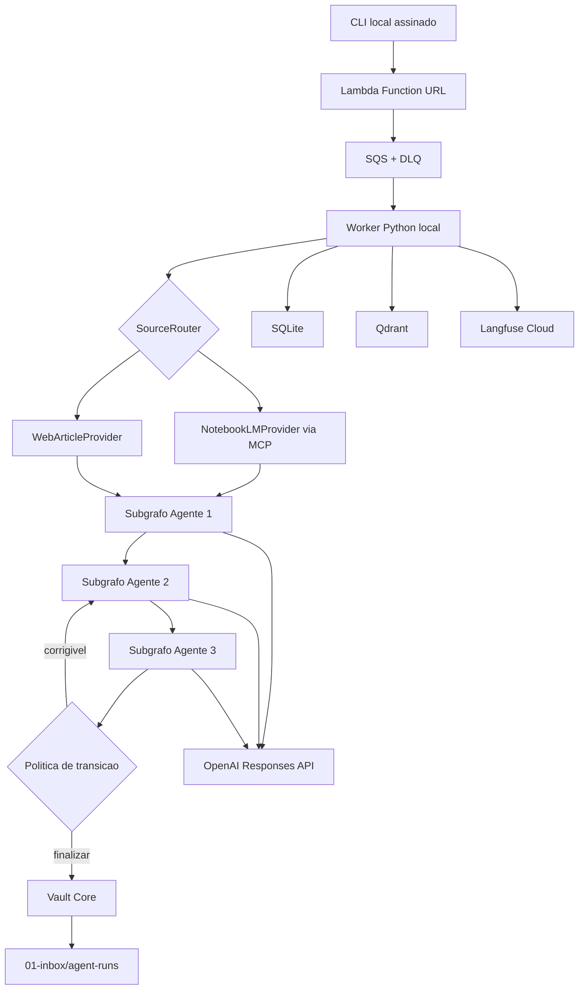
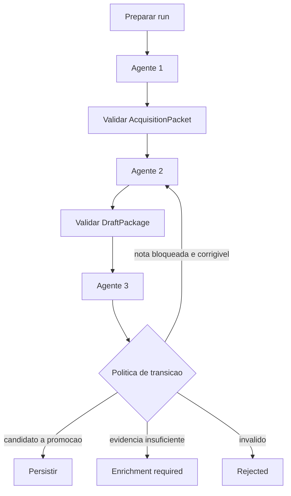

# Brainstorm - Agentic Knowledge Acquisition

## Status do documento

Este documento consolida a fase de brainstorm do projeto. Ele foi validado humanamente em 2026-07-18 e usado como entrada formal para `/define`.

Ele registra:

- problema e posicionamento do projeto;
- amostras usadas como grounding;
- alternativas consideradas;
- decisoes arquiteturais validadas;
- escopo da primeira versao publica;
- riscos, itens adiados e criterios de sucesso;
- requisitos preliminares que ainda serao formalizados.

Este documento nao autoriza implementacao, deploy, promocao de notas ou publicacao de dados.

## Resumo executivo

O projeto sera um pipeline governado de aquisicao de conhecimento para um vault Obsidian. Ele transformara fontes heterogeneas em evidencias, pacotes de aquisicao, drafts atomicos e decisoes de validacao rastreaveis.

O posicionamento recomendado para portfolio e:

> A governed and evaluated multi-source knowledge ingestion pipeline with Agentic RAG, data contracts, provenance, observability, and evidence-driven cloud evolution.

O sistema usara tres agentes logicos orquestrados por LangGraph:

1. Agente 1 adquire e estrutura evidencias.
2. Agente 2 compara com o vault e cria drafts.
3. Agente 3 valida os drafts e define sua elegibilidade.

Os agentes nao serao processos independentes. Eles serao subgrafos dentro de um monolito modular Python executado localmente no MVP.

NotebookLM sera o primeiro provedor real de aquisicao, mas nao sera uma dependencia obrigatoria da arquitetura. Um `WebArticleProvider` deterministico sera implementado na mesma primeira versao publica para demonstrar portabilidade. O mesmo post da CrewAI sera processado pelas duas rotas e usado em uma avaliacao comparativa.

A AWS funcionara inicialmente como trigger e fila:

```text
Lambda Function URL -> Lambda -> SQS -> worker Python local
```

O worker local executara LangGraph, OpenAI, SQLite, MCP NotebookLM, Qdrant e Vault Core. Somente Qdrant usara Docker no MVP. ECS, DynamoDB, S3, Qdrant Cloud e publicacao automatizada por GitHub App ficam para evolucoes posteriores.

## Problema e oportunidade

### Problema

A aquisicao de conhecimento atual depende de execucoes manuais e de um fluxo historico que termina antes da criacao e promocao governada de notas. Repetir uma solicitacao manual ao Codex para cada nova fonte nao oferece:

- contratos estaveis entre etapas;
- recuperacao apos falhas;
- idempotencia;
- medicao consistente de custo e qualidade;
- comparacao entre metodos de aquisicao;
- evolucao segura para processamento distribuido;
- separacao verificavel entre draft, validacao e promocao.

### Oportunidade

O vault e o historico de aquisicao ja fornecem grounding real para construir um prototipo que demonstre competencias de AI Data Engineer e AI Engineer:

- ingestao de dados nao estruturados;
- contratos e linhagem;
- processamento orientado a eventos;
- sistemas multiagente;
- RAG e banco vetorial;
- observabilidade de LLM;
- avaliacao e governanca de qualidade;
- infraestrutura como codigo;
- estrategia de evolucao local para cloud.

## Objetivos

### Objetivo principal

Construir uma primeira versao publica capaz de processar uma fonte por execucao, via NotebookLM ou URL direta de blog, e produzir drafts governados no vault com proveniencia, validacao e rastreabilidade operacional.

### Objetivos secundarios

- Demonstrar que o nucleo dos agentes nao depende do NotebookLM.
- Comparar qualidade, custo e latencia de dois provedores de aquisicao.
- Preservar os contratos e artefatos historicos do vault.
- Permitir retomada de execucoes sem repetir etapas concluidas.
- Manter promocao, commit, push e merge sob controle humano.
- Preparar fronteiras que permitam migrar o processamento direto para ECS.
- Produzir um repositorio de portfolio seguro e reproduzivel.

## Nao objetivos da primeira versao

- Rodar os agentes em ECS.
- Processar multiplas fontes em uma unica execucao.
- Adquirir diretamente PDF, EPUB, audio ou video.
- Descobrir fontes automaticamente.
- Promover notas automaticamente.
- Criar commits ou pull requests automaticamente.
- Usar CrewAI como segundo orquestrador.
- Definir thresholds numericos definitivos de qualidade.
- Retornar automaticamente ao Agente 1 para nova aquisicao.
- Executar um crawler geral ou um browser web local.
- Tornar o sistema production-ready ou multiusuario.

## Grounding analisado

### Grounding historico do vault

Foi selecionada a campanha do capitulo 13, "Human-Agent Collaboration", do livro *Building Applications with AI Agents: Designing and Implementing Multiagent Systems*.

Artefatos principais:

- pacote do Agente 1 em `94-features/notebooklm-knowledge-acquisition/examples/`;
- plano de curadoria do Agente 2 em `94-features/notebooklm-knowledge-acquisition/curation-plans/`;
- decision packet do Agente 2;
- review final do Agente 3 em `94-features/notebooklm-knowledge-acquisition/validation-reviews/`.

Insights obtidos:

- o fluxo historico ja separa aquisicao, curadoria e validacao;
- o fluxo historico termina com `write_allowed: false` e nao produz drafts promoviveis;
- novos contratos devem evoluir os existentes sem sobrescrever artefatos historicos;
- o Agente 3 deve permanecer autoridade terminal de validacao;
- escrita deve ser feita por um componente deterministico, nao pelo LLM.

### Caso real da primeira avaliacao

Fonte escolhida:

> "How We Built Cognitive Memory for Agentic Systems." CrewAI, March 5, 2026.

O post ja foi adicionado a um notebook compartilhado contendo apenas essa fonte.

Conceitos duraveis esperados:

- memoria como cognicao, nao apenas armazenamento;
- operacoes de encode, consolidate, recall, extract e forget;
- fluxo de codificacao e recuperacao;
- resolucao de contradicoes;
- extracao de memorias atomicas;
- combinacao de similaridade, recencia e importancia;
- diferenca entre state e memory;
- lacunas de confianca e evidencia.

Conteudo potencialmente versionado:

- APIs `Memory`, `remember`, `recall`, `extract_memories` e `forget`;
- configuracao `memory=True`;
- CLI `crewai memory`;
- CrewAI Flows e backend LanceDB.

Alegacoes que exigem validacao ou qualificacao:

- bilhoes de execucoes;
- menor custo, maior velocidade ou maior confiabilidade;
- superioridade sobre abordagens somente vetoriais;
- comportamento automatico de resolucao de contradicoes.

Resultado minimo esperado:

- ao menos um draft util que possa ser promovido depois da revisao sem correcao factual essencial;
- alegacoes volateis ou sem suporte corretamente bloqueadas;
- manifest, proveniencia, traces e indexacao disponiveis;
- nenhuma promocao automatica.

## Alternativas consideradas

### Abordagem A - Solicitacao manual recorrente ao Codex

Cada nova fonte seria processada manualmente em uma conversa.

Vantagens:

- menor custo inicial de implementacao;
- alta flexibilidade;
- boa opcao para exploracao ad hoc.

Desvantagens:

- baixa repetibilidade;
- ausencia de contratos operacionais;
- recuperacao e idempotencia manuais;
- medicao inconsistente;
- pouco valor como demonstracao de engenharia de dados e agentes.

Decisao: rejeitada como arquitetura principal. Codex continua como supervisor, enriquecedor e promotor manual.

### Abordagem B - NotebookLM como gateway obrigatorio

Todas as fontes seriam sempre processadas pelo NotebookLM.

Vantagens:

- reduz trabalho inicial de parsing e preparacao de fontes;
- suporta varios formatos;
- fornece respostas grounded e citacoes;
- aproveita o MCP ja validado.

Desvantagens:

- automacao atual depende de navegador e sessao Google;
- dificulta execucao integral em ECS;
- cria teto de throughput e risco de bloqueio operacional;
- torna o nucleo dependente de uma integracao nao oficial para o produto pessoal.

Decisao: rejeitada como dependencia obrigatoria, mantida como primeiro provedor funcional.

### Abordagem C - Provedores substituiveis com contrato comum

NotebookLM, web direta e futuros provedores implementam uma interface comum de inspecao e recuperacao de evidencias.

```text
KnowledgeSourceGateway
|- NotebookLMProvider
|- WebArticleProvider
|- DocumentProvider (futuro)
`- MediaProvider (futuro)
```

Vantagens:

- desacopla agentes da tecnologia de aquisicao;
- permite migracao integral de provedores diretos para ECS;
- permite avaliacao comparativa entre rotas;
- reduz vendor lock-in;
- preserva o valor do NotebookLM sem torna-lo obrigatorio.

Desvantagens:

- exige contrato adicional antes do Agente 1;
- o projeto passa a responder por parsing, chunking e proveniencia nas rotas diretas;
- aumenta o escopo da primeira versao.

Decisao: abordagem selecionada.

## Arquitetura selecionada



### Principios

- Monolito modular, nao microservicos.
- Um processo Python para worker, LangGraph e agentes.
- Um subprocesso Node.js para o proxy MCP NotebookLM.
- Qdrant como unico servico local em Docker.
- Markdown como fonte de verdade.
- Qdrant como indice derivado e reconstruivel.
- Agentes comunicam por contratos, nao por conversa livre.
- LLMs nao recebem shell, Git ou escrita arbitraria.
- Promocao e publicacao permanecem humanas.
- Fronteiras externas podem receber implementacoes cloud no futuro.
- Citacoes e frases destacadas usam um unico idioma; a preferencia editorial e ingles, exceto quando a fidelidade da fonte exigir outro idioma.

## Toolchain e tecnologias

### Runtime

- Python 3.12.
- `uv` para Python, ambiente, dependencias e lockfile.
- `pyproject.toml` e `uv.lock` versionados.
- Node.js 18 ou superior para o MCP existente.
- Docker Desktop apenas para Qdrant.

### Aplicacao

- LangGraph como unico orquestrador do MVP.
- OpenAI Responses API como provedor de LLM.
- Structured Outputs e Pydantic para contratos.
- Mesmo modelo de LLM para os tres agentes na baseline.
- `text-embedding-3-small` como embedding inicial.
- Langfuse Cloud para traces, spans e metricas de LLM.
- SQLite para estado local e checkpoints.
- Qdrant para recuperacao vetorial.
- Boto3/Botocore para AWS e assinatura SigV4.
- HTTPX e Trafilatura para aquisicao direta de blogs.
- SDK Python oficial MCP, linha estavel v1 no MVP (`mcp>=1.27,<2`), sujeito a revalidacao na fase de design.

### Qualidade e infraestrutura

- Ruff.
- Pytest.
- Terraform.
- Git e GitHub apenas na camada de revisao/publicacao.

### Tecnologias adiadas

- CrewAI como experimento comparativo posterior.
- Firecrawl como fallback web futuro.
- Docling para documentos, audio e video futuros.
- Amazon Textract e Amazon Transcribe como rotas especializadas futuras.

## Repositorios e dados

### Repositorio publico da aplicacao

Contera:

- codigo Python;
- Terraform;
- contratos;
- testes;
- fixtures sanitizadas;
- demo vault;
- documentacao, ADRs e relatorios de avaliacao permitidos.

Nao contera:

- vault real;
- URLs compartilhadas reais do NotebookLM;
- chaves e tokens;
- SQLite operacional;
- dados do Qdrant;
- traces brutos;
- HTML completo de fontes;
- perfis de navegador;
- caminhos locais absolutos.

### Repositorio do vault

Contera notas, drafts e manifests. O vault sera referenciado externamente por `VAULT_PATH` e nao sera incluido como subdiretorio do repositorio publico da aplicacao.

## Estrutura proposta do monolito modular

```text
knowledge-acquisition-agents/
|- pyproject.toml
|- uv.lock
|- .python-version
|- .env.example
|- src/knowledge_agents/
|  |- cli.py
|  |- config.py
|  |- contracts/
|  |- graph/
|  |- agents/
|  |- providers/
|  |- infrastructure/
|  `- vault/
|- tests/
|  |- unit/
|  |- contracts/
|  |- integration/
|  |- evals/
|  `- fixtures/
|- infra/terraform/
`- docs/
   |- architecture/
   `- adr/
```

Fronteiras principais:

```text
AcquisitionProvider
RunStore
ArtifactStore
VectorStore
LLMProvider
DraftPublisher
```

Substituicoes futuras:

```text
SQLite             -> DynamoDB
Filesystem         -> S3
Qdrant local       -> Qdrant Cloud
LocalVaultPublisher -> GitHubPullRequestPublisher
Worker local       -> ECS
```

Nao sera usado framework de injecao de dependencias. As implementacoes serao montadas na inicializacao do worker por configuracao explicita.

## Trigger AWS e execucao local

### Contrato externo inicial

A Lambda validara apenas uma URL no payload externo:

```json
{
  "url": "https://..."
}
```

O cliente gera um `Idempotency-Key`. Esse valor se torna o `run_id` logico e deve ser reutilizado quando o trigger for repetido por falha de transporte.

### Autenticacao

- Lambda Function URL com `AWS_IAM`.
- Cliente local assina o corpo exato com SigV4 via Botocore.
- Preferencia por credenciais temporarias de perfil/SSO.
- Nenhuma credencial AWS no payload, repositorio ou log.

### CLI

O comando preferido sera interativo para evitar URL do NotebookLM no historico do shell:

```powershell
uv run knowledge-agents trigger
```

O worker sera iniciado manualmente:

```powershell
uv run knowledge-agents worker start
```

Nao havera Windows Service, Task Scheduler, auto-start ou container para os agentes no MVP.

### Fluxo de mensagem

- Lambda publica na SQS principal.
- Worker faz long polling.
- Visibility timeout inicial proposto: 5 minutos.
- Renovacao proposta: a cada 2 minutos para mais 5 minutos.
- Mensagem e removida somente depois de draft, manifest e estado estarem duraveis.
- Apos tres recebimentos sem sucesso, a mensagem vai para DLQ.
- Valores exatos serao revalidados em `/design`.

## Provedores de aquisicao

### Interface comum

Operacoes conceituais:

```python
inspect() -> SourceDescriptor
retrieve(query) -> EvidenceBatch
```

O Agente 1 nao recebe credenciais nem conhece detalhes de autenticacao. Ele trabalha com descritores e evidencias estruturadas.

### NotebookLMProvider

NotebookLM sera usado como interface multiformato para o primeiro fluxo real.

Integracao:

- reutilizar o proxy seguro existente em `.mcp-local/notebooklm-mcp/notebooklm-safe-proxy.mjs`;
- iniciar o proxy Node.js por stdio a partir do cliente MCP Python;
- usar somente tools read-only autorizadas;
- validar `server_health` antes da aquisicao;
- usar principalmente `notebook_ask` e `content_list`;
- manter `HEADLESS=true` e `AUTO_LOGIN_ENABLED=false`;
- manter o diretorio de autenticacao fora do vault e do repositorio publico;
- nunca executar login, logout, criacao ou exclusao pelo agente.

NotebookLM continua util para livros, videos, artigos e outros formatos, mas a decisao de usa-lo para novas fontes sera avaliada caso a caso.

### WebArticleProvider

Primeira implementacao direta:

```text
URL
-> validacao SSRF
-> HTTPX
-> HTML bruto + hash
-> Trafilatura
-> documento normalizado
-> blocos de evidencia
-> Agente 1
```

Regras:

- aceitar apenas HTTP e HTTPS;
- rejeitar localhost, redes privadas, link-local e metadata da AWS;
- revalidar redirects;
- limitar tamanho, duracao e quantidade de redirects;
- aceitar apenas content types previstos;
- nao executar JavaScript;
- nao enviar cookies ou credenciais;
- falhar como `acquisition_blocked` quando a extracao nao for suficiente.

### Firecrawl futuro

Firecrawl sera uma estrategia de fallback, nao o default:

```text
StaticHtmlStrategy
-> validacao estrutural
-> FirecrawlStrategy se necessario
-> acquisition_blocked se ainda insuficiente
```

O contrato de `EvidenceDocument` registrara `acquisition_method`, permitindo adicionar o fallback sem alterar os agentes.

## Contratos preliminares

Todos os contratos terao `contract_version` e validacao Pydantic.

### AcquisitionRequest

- `run_id` interno;
- `url`;
- `provider` derivado;
- `execution_target` derivado;
- `contract_version`.

### SourceDescriptor

- provedor;
- tipo de fonte conhecido ou inferido;
- titulo;
- localizador mascarado;
- metodo de aquisicao;
- alertas de descoberta.

### EvidenceBatch

- identificador da consulta;
- blocos de evidencia;
- localizadores de proveniencia;
- hashes;
- alertas;
- metodo de aquisicao.

### AcquisitionPacket

Saida do Agente 1, evoluindo os pacotes historicos sem sobrescreve-los.

Devera incluir:

- conceitos candidatos;
- alegacoes e evidencias;
- proveniencia;
- classificacao entre duravel, versionado e nao suportado;
- lacunas e riscos;
- hashes dos inputs relevantes.

### DraftPackage

Saida do Agente 2:

- uma ou mais notas atomicas;
- relacoes propostas;
- proveniencia;
- status inicial;
- `content_hash` por draft;
- contexto do vault utilizado;
- alertas de duplicidade.

### ReviewPackage

Saida do Agente 3:

- decisao por nota;
- problemas codificados;
- acao requerida;
- hash exato revisado;
- status do pacote;
- indicacao de correcao ou enriquecimento.

### RunManifest

- `run_id`;
- fonte e provedor;
- versoes de contratos, prompts e aplicacao;
- paths e hashes dos artefatos;
- decisoes do Agente 3;
- warnings e pendencias de reparo;
- metricas resumidas;
- status final.

## Os tres agentes no monolito

### Modelo de execucao

Cada agente sera um subgrafo logico, nao um servico:

```text
LangGraph principal
|- Subgrafo Agente 1
|- Subgrafo Agente 2
|- Subgrafo Agente 3
`- Vault Core deterministico
```

Cada agente tera:

- prompt versionado;
- schema de saida Pydantic;
- conjunto minimo de ferramentas;
- politica de contexto;
- pre e pos-validacoes deterministicas.

### Agente 1 - aquisicao

Responsabilidades:

- usar o provedor selecionado;
- estruturar evidencias;
- separar conceitos duraveis de detalhes volateis;
- registrar gaps e limites;
- produzir `AcquisitionPacket`.

Nao pode escrever no vault, executar shell ou alterar fontes.

### Agente 2 - curadoria e drafts

Responsabilidades:

- consultar primeiro notas promovidas no Qdrant;
- consultar drafts como contexto secundario;
- detectar duplicidade e oportunidade de atualizacao;
- produzir notas atomicas;
- produzir `DraftPackage`.

Nao pode escrever diretamente no vault ou promover notas.

### Agente 3 - validacao

Responsabilidades:

- revisar o hash e a versao exata de cada draft;
- verificar suporte factual, proveniencia, utilidade e riscos;
- classificar cada nota;
- produzir problemas objetivos para eventual correcao.

Status por nota:

```text
promotion_candidate
enrichment_required
rejected
```

Status do pacote:

```text
ready
partially_ready
enrichment_required
rejected
```

## LangGraph principal, transicoes e correcoes

O LangGraph principal sera a maquina de estados e governanca. Os agentes produzem decisoes semanticas; o grafo aplica limites deterministas.



Regras de correcao:

- apenas notas bloqueadas retornam ao Agente 2;
- notas aprovadas ficam congeladas por hash;
- no maximo dois ciclos editoriais condicionais;
- segundo ciclo somente quando houve progresso verificavel;
- repeticao do mesmo problema encerra como `enrichment_required`;
- falta de evidencia nao retorna ao Agente 1 no MVP;
- timeout tecnico nao consome ciclo editorial;
- reparo de schema nao consome ciclo editorial.

Estado minimo para governanca:

```text
revision_count
blocked_note_ids
approved_note_hashes
previous_issue_fingerprint
remaining_token_budget
artifact_refs
```

## Chamadas de LLM e contexto

### Principio de chamadas

- Uma chamada estruturada principal por agente e por pacote.
- Operacoes deterministicas e consultas ao provedor ficam ao redor da chamada.
- Nenhuma chamada por nota no happy path.
- Revisoes agrupam somente notas bloqueadas.

Quantidade esperada de chamadas principais:

```text
happy path: 3
um ciclo editorial: 5
dois ciclos editoriais: 7
```

### ContextBudgetManager

Componente deterministico reutilizado antes de cada chamada:

```text
Context Gate A1 -> Agente 1
Context Gate A2 -> Agente 2
Context Gate A3 -> Agente 3
```

Acoes:

```text
proceed
reduce
split
block
```

Formula conceitual:

```text
operational_budget = min(
  model_context_window - output_and_reasoning_reserve - safety_margin,
  quality_cap,
  remaining_run_token_or_cost_cap
)
```

Regras:

- preservar evidencias e proveniencia criticas;
- remover contexto Qdrant irrelevante antes de dividir;
- dividir por nota somente quando o pacote exceder o budget operacional;
- usar contagem oficial de tokens perto do limite;
- registrar estimativa, uso real, reserva e acao;
- colocar prefixo estatico antes do conteudo variavel para favorecer prompt caching.

Thresholds exatos serao definidos somente depois de dados reais.

## Drafts, promocao e Git

### Escrita local

Agentes nao escrevem diretamente. O Vault Core valida e grava atomicamente:

```text
01-inbox/agent-runs/{run_id}/
|- manifest.md
`- drafts/
   |- draft-a.md
   `- draft-b.md
```

Notas nao enriquecidas podem ser preservadas quando tiverem utilidade potencial:

- `promotion_candidate`: util sem enriquecimento obrigatorio;
- `enrichment_required`: util, mas bloqueada para promocao;
- `rejected`: permanece no registro da execucao, sem virar nota util.

### Promocao

- Codex e a camada manual inicial de enriquecimento e promocao.
- Um draft pode ser aprovado sem enriquecimento se for util para o vault.
- Enriquecimento essencial bloqueia a promocao.
- Enriquecimento opcional nao bloqueia.
- Notas poderao ser enriquecidas novamente depois da promocao.

Versoes conceituais:

```text
v1_agent_draft
v2_codex_enriched
v3_promoted
```

### Git local

- Drafts aparecem no working tree do vault.
- Worker nao cria branch, commit, push ou PR.
- Codex prepara alteracoes Git somente quando solicitado.
- Commit deve ser limitado ao run e as notas promovidas relacionadas.
- Usuario revisa commit, PR e merge.
- Mudancas nao relacionadas no vault nunca devem ser incluidas ou revertidas.

## Qdrant

### Papel

Qdrant e indice derivado, nao fonte de verdade.

```text
Markdown/ArtifactStore -> indexador -> Qdrant
```

Nao existe sincronizacao reversa. Edicoes diretas no Qdrant serao sobrescritas ou removidas pela proxima sincronizacao.

### Collections

```text
vault_notes_v1
vault_drafts_v1
source_evidence_v1
```

- `vault_notes_v1`: notas promovidas e confiaveis.
- `vault_drafts_v1`: drafts e backlog de enriquecimento.
- `source_evidence_v1`: blocos adquiridos de fontes em processamento.

### Payload minimo

```text
note_id
path relativo
title
heading
domain
tags
lifecycle_status
content_hash
updated_at
run_id quando aplicavel
```

### Escopo do vault

Allowlist inicial proposta:

```text
02-maps-of-content
03-concepts
04-tools-and-platforms
05-data-architecture
06-pipeline-patterns
07-troubleshooting
08-playbooks-and-checklists
09-architecture-decisions
10-projects-and-case-studies
11-ai-for-data-engineering
13-references
15-generative-ai
16-ai-agents
17-llm-systems
18-rag-and-knowledge-systems
19-mcp
```

Exclusoes iniciais:

```text
.git
.obsidian
.Codex
00-system-spec
14-operational-agents
90-templates
91-taxonomy-and-config
92-review-and-maintenance
93-vault-organization
94-features
99-archive
AGENTS.md
arquivos binarios
```

`01-inbox` nao entra na collection canonica. Somente drafts gerados entram em `vault_drafts_v1`.

Uma nota podera declarar `indexing: false` no futuro.

### Privacidade cloud

O vault real nao sera enviado integralmente ao Qdrant Cloud na primeira migracao. O primeiro uso cloud devera limitar-se a:

- demo vault sanitizado;
- notas explicitamente autorizadas;
- dados publicos do experimento CrewAI.

## Sincronizacao do indice

Sincronizacao unidirecional e incremental.

Comandos previstos:

```powershell
uv run knowledge-agents index status
uv run knowledge-agents index sync
uv run knowledge-agents index rebuild
```

Momentos:

- no startup do worker, antes de consumir mensagens;
- depois da escrita de drafts;
- depois de promocao pelo Codex;
- sob demanda.

Registro SQLite proposto:

```text
path
note_id
content_hash
index_fingerprint
collection
point_ids
indexed_at
status
```

`index_fingerprint` inclui:

```text
content_hash
chunker_version
embedding_model
embedding_dimensions
index_schema_version
```

Comportamento:

- nota sem mudanca: ignorar;
- nota nova: chunk, embedding e upsert;
- nota alterada: criar nova geracao, validar e remover anterior;
- nota removida: remover pontos;
- nota fora da allowlist: ignorar ou remover;
- falha parcial: manter versao anterior e marcar `index_failed`;
- scan incompleto: nunca concluir delecoes.

Notas existentes usam path relativo como identidade quando nao houver `note_id`. Novos drafts recebem identificador estavel. Nao havera migracao em massa apenas para adicionar IDs.

## Estado operacional e artefatos

### Local

SQLite armazena:

- status do run;
- etapa atual;
- tentativas;
- idempotencia;
- leases e timestamps;
- referencias de artefatos;
- checkpoints LangGraph;
- estado do indexador.

Artefatos grandes ficam no filesystem, nao no estado do grafo.

### Cloud futura

```text
DynamoDB
|- runs
|- status e etapa
|- tentativas e leases
|- idempotencia
`- referencias

S3
|- EvidenceBatch
|- AcquisitionPacket
|- DraftPackage
|- ReviewPackage
|- manifests
`- checkpoints grandes
```

Alvo inicial:

- DynamoDB para metadados pequenos e escritas condicionais;
- S3 para artefatos e payloads grandes;
- `langgraph-checkpoint-aws` como candidato para checkpoints;
- Qdrant Cloud Free para demo sanitizada, nao para o vault completo.

## Retries, recuperacao e idempotencia

### Taxonomia

```text
transport retry
contract repair
editorial revision
run resume
secondary repair
replay
```

- Retry mantem modelo, prompt, input e `run_id`.
- Replay cria novo `run_id`.

### Erros transitorios

Timeout, conexao, HTTP 408, 429 ou 5xx:

- ate tres tentativas no owner da integracao;
- exponential backoff com jitter;
- evitar retries aninhados.

Ownership proposto:

- OpenAI SDK: retry de transporte OpenAI;
- LangGraph RetryPolicy: NotebookLM e providers quando aplicavel;
- SQS: redelivery do run;
- index repair: Qdrant;
- resend local: Langfuse.

### Erros de contrato

- schema invalido ou Structured Output incompleto: uma tentativa de reparo;
- depois disso, falha da etapa.

### Erros humanos ou permanentes

- sessao NotebookLM expirada: parar e solicitar reautenticacao fora do agente;
- acesso negado: sem retry automatico;
- URL invalida ou SSRF: falha permanente;
- path traversal: falha permanente;
- conteudo suspeito: bloquear.

### Sucesso principal e falhas secundarias

Sucesso principal exige:

- drafts validados persistidos;
- manifest persistido;
- estado SQLite duravel.

Falha posterior de Qdrant ou Langfuse gera:

```text
completed_with_warnings
pending_repair
```

Os agentes nao sao executados novamente.

CLI futura:

```powershell
knowledge-agents runs resume <run_id>
knowledge-agents repairs run <run_id>
knowledge-agents runs replay <run_id>
```

## Observabilidade e visibilidade

### Langfuse

Uma trace por aquisicao, com trace ID igual ao `run_id`.

Spans:

- aquisicao;
- cada agente;
- context gates;
- retrieval Qdrant;
- persistencia;
- revisoes;
- reparos.

Registrar:

- modelo;
- versao de prompt e aplicacao;
- tokens e cache;
- custo e latencia;
- tools e erros;
- IDs de retrieval;
- transicoes e motivo;
- outcome final.

Mascarar:

- URL completa do NotebookLM;
- chaves e credenciais;
- caminhos absolutos locais;
- conteudo do vault sem necessidade;
- cookies e perfis de navegador.

### SQLite e CLI

- estado atual;
- timestamps;
- tentativas;
- erro sanitizado;
- hashes;
- artefatos;
- reparos pendentes.

### Manifest

Registro duravel das decisoes, versoes, evidencias e outputs de cada run.

### CloudWatch

- invocacoes e erros da Lambda;
- idade e tamanho da fila;
- DLQ;
- alarmes para mensagem mais antiga e DLQ nao vazia.

Observabilidade nao substitui controles de seguranca.

## Doctor e health checks

Comando:

```powershell
uv run knowledge-agents doctor
```

Proposito: diagnostico preventivo do ambiente, sem consumir mensagens ou executar agentes.

Checks:

- Python e Node;
- configuracao obrigatoria;
- AWS e SQS;
- MCP e autenticacao NotebookLM;
- OpenAI sem chamada paga de geracao;
- Langfuse;
- Qdrant;
- acesso ao vault;
- abertura e migracao do SQLite.

O `doctor` reutiliza os mesmos checks do startup do worker. Saida deve ser sanitizada e retornar codigo diferente de zero para falhas criticas.

## Seguranca

### Trigger e AWS

- Function URL com AWS IAM.
- SigV4.
- credenciais temporarias.
- least privilege.
- papeis separados conceitualmente para provisioner, trigger e worker.
- nenhum secret em Terraform vars versionadas.

### Conteudo nao confiavel

- toda fonte externa e potencial prompt injection;
- instrucoes contidas na fonte nao controlam ferramentas;
- agentes nao recebem shell, Git ou escrita arbitraria;
- outputs sao validados por Pydantic;
- proveniencia e hashes acompanham cada decisao;
- alegacoes volateis devem ser qualificadas ou bloqueadas.

### Vault Core

- escreve somente em staging e `01-inbox/agent-runs`;
- valida path traversal;
- usa escrita atomica;
- nao sobrescreve nota existente sem regra explicita;
- nao promove, move ou apaga nota canonica;
- verifica idempotencia e hashes.

### WebArticleProvider

- SSRF protection;
- limites de tamanho, tempo e redirects;
- sem cookies;
- sem autenticacao;
- sem JavaScript no primeiro release;
- HTML bruto fora do Git e do Langfuse.

### Limites operacionais

- limite de chamadas;
- limite de tokens e custo;
- limite de ciclos;
- limite de tempo;
- maximo de uma fonte por run;
- nenhum auto-merge ou auto-promotion.

## Testes e avaliacao

### Testes padrao

Rodam sem rede, segredos ou custo:

```powershell
uv run pytest
```

Categorias:

- unitarios;
- contratos;
- integracao com fakes/stubs;
- seguranca.

Casos obrigatorios:

- roteamento por URL;
- transicoes e limite de ciclos;
- hashes e idempotencia;
- retry ownership;
- duplicate delivery;
- SSRF e path traversal;
- prompt injection;
- escrita parcial;
- falha do worker entre agentes;
- Qdrant ou Langfuse indisponivel;
- congelamento de drafts aprovados.

Fakes previstos:

```text
FakeOpenAI
FakeNotebookLMProvider
FakeWebArticleProvider
FakeQdrant
TemporaryVault
InMemoryRunStore
```

Nao sera adicionado LocalStack inicialmente.

### Testes live

```powershell
uv run pytest -m live
```

Verificam integracoes reais de forma minima e explicita. Nunca rodam por default ou em CI sem decisao posterior.

### Evals

```powershell
uv run pytest -m eval
```

Comparam:

- NotebookLMProvider versus WebArticleProvider;
- cobertura de conceitos;
- alegacoes sem suporte;
- proveniencia;
- duplicidade;
- drafts uteis;
- edicao humana;
- custo, tokens e latencia;
- recuperacao e estabilidade.

Thresholds automaticos ficam adiados. A primeira baseline gera relatorio para revisao humana e Codex.

## CI e gate de publicacao

CI inicial:

```text
uv sync --locked
-> Ruff
-> pytest sem live/eval
-> terraform fmt -check
-> terraform validate
-> secret scan
```

Nao havera deploy automatico.

Antes do primeiro push publico:

- revisar arquivos rastreados;
- confirmar ausencia de secrets e URLs reais;
- confirmar fixtures sanitizadas;
- executar testes e linters;
- validar Terraform;
- revisar README e diagramas;
- revisar relatorio CrewAI permitido.

## Infraestrutura Terraform inicial

Ambiente unico `dev`, com root module simples:

```text
infra/terraform/
|- providers.tf
|- variables.tf
|- lambda.tf
|- queues.tf
|- iam.tf
|- monitoring.tf
|- outputs.tf
`- terraform.tfvars.example
```

Provisiona:

- Lambda;
- Function URL;
- SQS;
- DLQ;
- IAM;
- CloudWatch Log Group;
- alarmes basicos.

Estado Terraform local e ignorado inicialmente. Backend S3 somente antes de CI/CD ou colaboracao remota.

## Evolucao cloud

### Principio

MVP local, mas preparado para migracao. Escala sera orientada por gaps medidos, nao apenas por adicao de servicos.

Metricas de readiness:

- latencia por etapa;
- custo e tokens por run;
- idade e tamanho da fila;
- retries por dependencia;
- volume de artefatos;
- duracao do worker;
- frequencia de retomada;
- throughput;
- gargalos do NotebookLM.

### Primeira migracao

- WebArticleProvider e agentes compativeis migram para ECS.
- NotebookLM permanece local.
- Filas separam capacidade de execucao, nao tipo de fonte.

```text
notebooklm.google.com -> local-acquisition-queue -> worker local
URL publica direta   -> cloud-acquisition-queue -> ECS
```

No MVP existe somente uma fila e um worker local. As duas filas entram apenas com ECS.

### Persistencia cloud

- SQLite -> DynamoDB + S3.
- Qdrant local -> Qdrant Cloud para dados sanitizados/autorizados.
- `.env` -> Secrets Manager e task roles.
- filesystem local -> S3 ArtifactStore.

### Publicacao cloud de drafts

Primeira etapa recomendada:

```text
ECS -> S3 -> ready_for_review -> download local -> Vault Core -> Codex/Git
```

Etapa posterior:

```text
ECS -> GitHub App -> branch por run -> commit -> draft PR
```

Regras da GitHub App futura:

- acesso somente ao repositorio do vault;
- `Contents: write`, `Pull requests: write`, `Metadata: read`;
- installation token de curta duracao;
- private key no Secrets Manager;
- nunca escrever em `main`;
- nunca fazer merge;
- nunca usar PAT pessoal;
- nunca force push;
- PR sempre draft;
- branch protection e revisao humana.

## Por que NotebookLM nao vai para ECS inicialmente

Implicacoes identificadas:

- perfil persistente de Chrome e cookies sensiveis;
- primeiro login potencialmente visivel e manual;
- armazenamento efemero do Fargate;
- lock de perfil que limita concorrencia;
- imagem maior com Node e Chromium;
- rede externa e possivel custo de NAT;
- maior fragilidade por automacao de navegador;
- complexidade de reautenticacao e MFA;
- risco de acesso amplo a conta Google.

NotebookLM Enterprise possui APIs oficiais em preview, mas e outro produto, exige licenciamento e Google Cloud e nao reutiliza diretamente notebooks pessoais existentes. Deve ser monitorado, nao adotado agora.

## Roadmap funcional de aquisicao

```text
1. URL manual via NotebookLM ou blog direto
2. Descoberta assistida de fontes
3. Ingestao semiautomatica
4. Provedores diretos de documentos e midia
5. Aquisicao ativa governada
```

A prioridade imediata depois do MVP nao e descoberta. Primeiro devem ser identificados e corrigidos gaps de qualidade, custo, confiabilidade e infraestrutura.

## Entregas e marcos

### Marco 0 - Especificacao

- brainstorm validado;
- define;
- design tecnico;
- ADRs principais.

### Marco 1 - Bootstrap e operacao local

- repositorio publico separado;
- Python 3.12 + uv;
- config e `.env.example`;
- CLI;
- `doctor`;
- SQLite;
- Qdrant local;
- testes basicos.

### Marco 2 - Trigger e worker

- Terraform;
- Function URL;
- Lambda;
- SQS/DLQ;
- SigV4;
- worker local;
- idempotencia e checkpoints.

### Marco 3 - Vertical slice NotebookLM

- cliente MCP Python;
- proxy seguro existente;
- tres subgrafos;
- drafts e manifest;
- Langfuse;
- indexacao.

### Marco 4 - Portabilidade web

- WebArticleProvider;
- SSRF protection;
- evidence contract comum;
- mesma pipeline dos agentes.

### Marco 5 - Avaliacao CrewAI

- run NotebookLM;
- run web direta;
- relatorio comparativo;
- revisao humana;
- correcao de gaps principais.

### Marco 6 - Publicacao do portfolio

- README;
- diagramas;
- fixtures sanitizadas;
- testes e gate de seguranca;
- primeira release publica.

### Versao 2

- readiness report;
- DynamoDB e S3;
- Qdrant Cloud com dados permitidos;
- WebArticleProvider em ECS;
- filas separadas por capacidade;
- comparacao local versus cloud.

## YAGNI aplicado

Itens removidos da primeira versao e motivo:

| Item | Motivo do adiamento |
|---|---|
| ECS | Medir o fluxo local antes de migrar |
| DynamoDB e S3 | SQLite/filesystem sao suficientes no MVP |
| Firecrawl | Adicionar somente quando HTTP estatico falhar |
| Browser web local | Aumenta ruido, custo e superficie de seguranca |
| PDF/audio/video diretos | Nao necessarios para validar o caso CrewAI |
| Multiplas fontes | Uma fonte permite validar contratos e governanca |
| CrewAI orquestrador | LangGraph e o unico baseline |
| Thresholds automaticos | Faltam dados para calibracao defensavel |
| Auto-promotion | Contraria o requisito de revisao humana |
| Auto-commit/PR | Amplia risco antes de estabilizar drafts |
| LocalStack | Custo operacional sem beneficio proporcional |
| mypy/pre-commit/Dependabot | Podem entrar depois do bootstrap |
| Deploy CI/CD | Terraform manual e suficiente inicialmente |
| Worker como servico Windows | Startup manual e aceitavel no MVP |
| Agent loop para A1 | Evitar custo e aquisicao aberta sem controle |

## Riscos e mitigacoes

| Risco | Impacto | Mitigacao inicial |
|---|---|---|
| Sessao NotebookLM expira | Bloqueia provider | `doctor`, health check e reauth manual |
| Mudanca na UI NotebookLM | Quebra MCP | Provider opcional e web direta |
| Prompt injection | Acao indevida ou draft contaminado | Tools minimas, contratos e validacao |
| Duplicidade SQS | Custo e notas duplicadas | `run_id`, SQLite e hashes |
| Loop editorial | Custo e latencia | Maximo de dois ciclos e progress gate |
| Qdrant indisponivel | Retrieval/index incompleto | reparo independente e no rerun de agentes |
| Langfuse indisponivel | Perda de telemetria | resend local e `completed_with_warnings` |
| URL web maliciosa | SSRF/exfiltracao | validacao de DNS/IP/redirects e limites |
| Escrita fora do inbox | Corrupcao do vault | Vault Core com allowlist de paths |
| Vazamento no portfolio | Exposicao de dados | fixtures sanitizadas, secret scan e revisao |
| Qdrant Cloud com vault real | Exposicao de conhecimento | allowlist explicita e demo sanitizada |
| Alteracao de embedding | Vetores incompativeis | collection versionada |
| Worker encerra no meio | Reexecucao cara | checkpoint por subgrafo e resume |
| Repositorio dirty | Commit indevido | Codex com commit escopado e revisao humana |

## Requisitos preliminares

### Funcionais

- RF-01: aceitar uma URL por run.
- RF-02: gerar `run_id` idempotente no cliente.
- RF-03: rotear NotebookLM e blog direto para providers diferentes.
- RF-04: produzir contratos estruturados em cada agente.
- RF-05: criar uma ou mais notas atomicas por fonte.
- RF-06: validar cada nota pelo hash exato.
- RF-07: preservar drafts uteis mesmo quando exigirem enriquecimento.
- RF-08: gravar drafts somente em `01-inbox/agent-runs`.
- RF-09: gerar manifest por run.
- RF-10: indexar notas, drafts e evidencias em collections separadas.
- RF-11: permitir resume e reparo sem rerun completo.
- RF-12: produzir avaliacao comparativa das duas rotas.

### Nao funcionais

- RNF-01: nenhuma promocao, commit, push ou merge automatico.
- RNF-02: nenhum secret em repositorio ou trace.
- RNF-03: processamento idempotente sob entrega at-least-once.
- RNF-04: contratos versionados e validados.
- RNF-05: escrita atomica e path-safe.
- RNF-06: custos e tokens observaveis por run.
- RNF-07: testes default sem chamadas pagas.
- RNF-08: dados reais fora do repositorio publico.
- RNF-09: Qdrant reconstruivel a partir das fontes de verdade.
- RNF-10: componentes externos substituiveis por configuracao.
- RNF-11: falhas secundarias nao repetem LLMs.
- RNF-12: execucao local sem container para agentes.

## Criterios de sucesso da primeira versao publica

1. Terraform provisiona Function URL, Lambda, SQS, DLQ e alarmes basicos.
2. Trigger assinado aceita URL do NotebookLM ou blog publico.
3. Worker local executa health checks e consome a fila com idempotencia.
4. NotebookLMProvider e WebArticleProvider implementam o mesmo contrato.
5. Tres subgrafos produzem AcquisitionPacket, DraftPackage e ReviewPackage.
6. Correcoes respeitam hashes, notas congeladas, budget e limite de ciclos.
7. Drafts e manifest sao persistidos sem promocao automatica.
8. SQLite permite retomar a ultima etapa concluida.
9. Qdrant separa evidencias, notas promovidas e drafts.
10. Langfuse registra custo, tokens, latencia, tools e transicoes.
11. O post da CrewAI e processado pelas duas rotas.
12. Um relatorio compara qualidade, proveniencia, custo e intervencao humana.
13. Testes cobrem contratos, retries, SSRF, prompt injection, duplicidade e falhas parciais.
14. O repositorio publico nao contem secrets, URLs privadas, vault real ou fontes completas.
15. README e diagramas explicam arquitetura atual e migracao para ECS, DynamoDB, S3 e Qdrant Cloud.

## Questoes para as proximas fases

As decisoes abaixo nao bloqueiam o brainstorm, mas precisam ser resolvidas em `/define` ou `/design`:

- nome final do repositorio e do pacote Python;
- modelo OpenAI exato para a baseline;
- schemas Pydantic completos;
- prompts e politicas por tipo de fonte;
- algoritmo inicial de chunking;
- tamanho de batch de embeddings;
- layout exato dos artefatos fora do vault;
- migrations e schema SQLite;
- implementacao exata do checkpointer;
- limites de tokens, custo, tempo e tamanho de pagina;
- severidade de cada health check;
- politica de retencao de HTML e evidencias;
- criterios estruturais para acionar Firecrawl no futuro;
- formato do relatorio de eval;
- branch e estrategia de PR do repositorio publico;
- regiao AWS e naming dos recursos;
- politica de cleanup da DLQ e runs antigos.

## Fontes externas consultadas

- MCP Python SDK: <https://github.com/modelcontextprotocol/python-sdk>
- MCP SDKs: <https://modelcontextprotocol.io/docs/sdk>
- LangGraph: <https://docs.langchain.com/oss/python/langgraph/install>
- LangGraph persistence: <https://docs.langchain.com/oss/python/langgraph/persistence>
- LangGraph checkpointers: <https://docs.langchain.com/oss/python/integrations/checkpointers>
- uv projects: <https://docs.astral.sh/uv/guides/projects/>
- Qdrant Cloud free cluster: <https://qdrant.tech/documentation/cloud/create-cluster/>
- Qdrant pricing: <https://qdrant.tech/pricing/>
- Trafilatura: <https://trafilatura.readthedocs.io/en/stable/index.html>
- Docling formats: <https://docling-project.github.io/docling/usage/supported_formats/>
- Firecrawl scrape API: <https://docs.firecrawl.dev/api-reference/endpoint/scrape>
- NotebookLM Enterprise API: <https://docs.cloud.google.com/gemini/enterprise/notebooklm-enterprise/docs/api-notebooks>
- AWS Fargate storage: <https://docs.aws.amazon.com/AmazonECS/latest/developerguide/fargate-task-storage.html>
- AWS ECS task roles: <https://docs.aws.amazon.com/AmazonECS/latest/developerguide/task-iam-roles.html>
- DynamoDB constraints: <https://docs.aws.amazon.com/amazondynamodb/latest/developerguide/Constraints.html>
- GitHub App permissions: <https://docs.github.com/en/apps/creating-github-apps/registering-a-github-app/choosing-permissions-for-a-github-app>

## Historico de revisoes

| Versao | Data | Responsavel | Alteracoes |
|---|---|---|---|
| 0.1 | 2026-07-16 | Codex com supervisao humana | Consolidacao inicial do brainstorm. |
| 0.2 | 2026-07-18 | Codex com validacao humana | Padronizacao das citacoes em ingles, correcao dos diagramas Mermaid e aprovacao integral do checklist. |

## Checklist de validacao humana

Validacao concluida em 2026-07-18. Todos os pontos abaixo foram aprovados pelo responsavel pelo projeto.

- [x] O posicionamento de portfolio esta correto.
- [x] O escopo da primeira versao publica esta adequado.
- [x] NotebookLM como provider opcional esta correto.
- [x] WebArticleProvider pertence a primeira versao publica.
- [x] LangGraph como unico orquestrador do MVP esta correto.
- [x] Os tres agentes como subgrafos estao corretamente delimitados.
- [x] O limite de dois ciclos editoriais esta correto.
- [x] Falta de evidencia deve encerrar como `enrichment_required`.
- [x] Drafts nao enriquecidos devem ser preservados quando uteis.
- [x] Vault Core e promocao manual estao corretamente separados.
- [x] Politica de Git manual esta correta.
- [x] Escopo de indexacao do vault esta correto.
- [x] Qdrant Cloud nao recebera o vault real inicialmente.
- [x] ECS pertence a versao 2.
- [x] DynamoDB + S3 e o alvo correto para estado cloud.
- [x] Firecrawl permanece fallback futuro.
- [x] Criterios de sucesso sao suficientes para chamar o projeto de portfolio-ready.
- [x] Questoes abertas foram corretamente adiadas para define/design.

## Progresso do workflow

- Fase 0 concluida: brainstorm validado.
- Fase 1 concluida: [[DEFINE_AGENTIC_KNOWLEDGE_ACQUISITION]] gerado com clarity score de 15/15.
- Fase 2 iniciada: [[DESIGN_AGENTIC_KNOWLEDGE_ACQUISITION]] gerado como `draft`.

O proximo gate e a revisao humana do design antes de qualquer `/build`.
