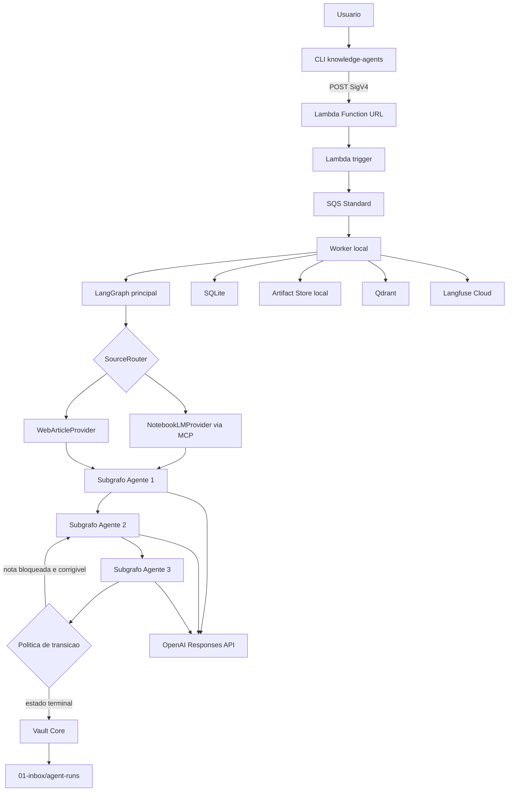
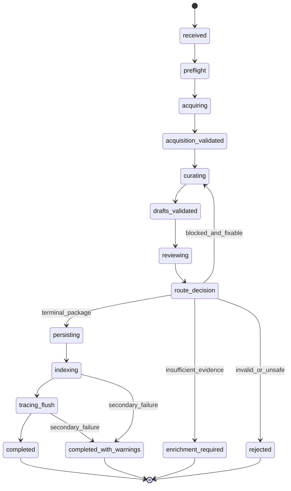

# Design - Agentic Knowledge Acquisition

## Status do documento

Este documento especifica a arquitetura tecnica da primeira versao publica. Ele foi revisado e aceito humanamente em 2026-07-20. A aprovacao autoriza a decomposicao em tarefas, mas nao autoriza deploy, uso de credenciais reais, promocao de notas ou publicacao automatica.

Documentos de entrada:

- [[BRAINSTORM_AGENTIC_KNOWLEDGE_ACQUISITION]]
- [[DEFINE_AGENTIC_KNOWLEDGE_ACQUISITION]]

## Resumo tecnico

O projeto sera publicado em um repositorio separado chamado `agentic-knowledge-pipeline`. O pacote Python sera `knowledge_agents` e a CLI sera `knowledge-agents`.

### Custodia dos artefatos SDD

As specs validadas de `BRAINSTORM`, `DEFINE`, `DESIGN` e `TASKS` foram transferidas para este repositorio antes do build. A origem e a `main` de `JpOlstan/data-engineering-knowledge-base`, no merge commit `6a43af3`, que contem o commit SDD `35903a8`.

A partir do primeiro commit deste repositorio, estas copias passam a ser a fonte canonica para iteracoes do produto; os documentos do vault permanecem como registro historico da fase de planejamento. O build report fica em `.Codex/sdd/reports/BUILD_REPORT_AGENTIC_KNOWLEDGE_ACQUISITION.md` e sera atualizado incrementalmente.

O MVP usa:

- Python 3.12 e `uv`;
- LangGraph como maquina de estados;
- OpenAI Responses API com Structured Outputs;
- `gpt-5.6-terra` como baseline configuravel dos tres agentes;
- `text-embedding-3-small` como baseline configuravel de embeddings;
- SQLite para estado operacional e checkpoints locais;
- Qdrant local em Docker como indice derivado;
- Langfuse Cloud com redacao client-side;
- Lambda Function URL autenticada por AWS IAM;
- SQS Standard com idempotencia na aplicacao;
- Terraform para infraestrutura AWS;
- Markdown e manifests como artefatos revisaveis.

## Arquitetura



### Fluxo do grafo



## Fronteiras de componentes

| Componente | Responsabilidade | Pode executar side effects | Nao pode fazer |
|---|---|---|---|
| CLI | Trigger, worker, doctor, runs, repairs e index | Somente comando explicito | Promover nota ou executar Git |
| Lambda trigger | Validar URL e enfileirar request | SQS `SendMessage` | Chamar LLM ou acessar vault |
| Worker | Lease, polling, heartbeat e execucao do grafo | SQLite, SQS e ports configurados | Alterar contratos semanticamente |
| SourceRouter | Escolher provider pela URL | Nenhum | Fazer fetch ou chamar LLM |
| Providers | Recuperar e normalizar fonte | Rede limitada ao provider | Escrever no vault |
| Agente 1 | Estruturar evidencia | Uma chamada OpenAI por pacote | Consultar shell, Git ou vault diretamente |
| Agente 2 | Curar e criar drafts | Uma chamada OpenAI por pacote | Persistir drafts |
| Agente 3 | Validar e classificar drafts | Uma chamada OpenAI por pacote | Promover ou publicar |
| RoutePolicy | Aplicar transicoes e budgets | Atualizar estado | Tomar decisao semantica nova |
| Vault Core | Renderizar e gravar drafts/manifests | Filesystem allowlisted | Escrever nota canonica |
| Indexer | Sincronizar Markdown para Qdrant | Qdrant e SQLite | Escrever de Qdrant para o vault |
| Telemetry | Registrar spans sanitizadas | Langfuse | Enviar payload bruto privado |

## Decisoes arquiteturais

### Decisao 001 - Monolito modular com ports e adapters

| Atributo | Valor |
|---|---|
| Status | Accepted |
| Data | 2026-07-18 |

**Contexto:** o MVP precisa rodar localmente e demonstrar separacao de responsabilidades sem custo operacional de microservicos.

**Escolha:** um processo Python contem aplicacao, LangGraph e agentes. Integracoes externas implementam protocols definidos no dominio.

**Racional:** preserva testabilidade e permite substituir SQS, SQLite, filesystem ou providers sem distribuir o sistema prematuramente.

**Alternativas rejeitadas:**

1. Microservico por agente: aumenta deploy, latencia, contratos de rede e observabilidade sem necessidade atual.
2. Script unico: reduz clareza, testabilidade e portabilidade futura.
3. CrewAI adicional: duplica orquestracao e impede uma baseline clara.

**Consequencias:** fronteiras devem ser fiscalizadas por imports e testes arquiteturais; o monolito nao autoriza acoplamento entre adapters e dominio. Como excecao explicita de orquestracao, apenas `application/graph` pode importar `langgraph`, seu checkpointer e o transporte `aiosqlite` exigido pelo checkpointer local; dominio, ports, agentes e services permanecem independentes de SDKs externos e de adapters concretos.

### Decisao 002 - LangGraph principal com subgrafos por invocacao

| Atributo | Valor |
|---|---|
| Status | Accepted |
| Data | 2026-07-18 |

**Contexto:** o pipeline precisa de checkpoints, retomada, correcoes limitadas e estado inspecionavel.

**Escolha:** `StateGraph` principal compilado com `AsyncSqliteSaver`; cada agente e um subgrafo adicionado estaticamente e compilado com `checkpointer=None`, herdando o checkpointer do parent durante a invocacao.

**Racional:** a documentacao atual do LangGraph recomenda persistencia por invocacao para subagentes independentes e usa checkpointers para fault tolerance e retomada.

**Consequencias:** `thread_id` e igual ao `run_id`; estado entre agentes passa apenas por schemas; artefatos grandes sao referenciados por path e hash.

### Decisao 003 - OpenAI Responses API com baseline unica

| Atributo | Valor |
|---|---|
| Status | Accepted |
| Data | 2026-07-18 |

**Contexto:** os agentes precisam produzir contratos estritos com custo observavel e comparacao justa entre providers.

**Escolha:** OpenAI Responses API com `client.responses.parse` e modelos Pydantic. A baseline usa `gpt-5.6-terra` nos tres agentes; model ID e reasoning effort sao configuraveis por agente.

**Racional:** a documentacao atual posiciona Terra como equilibrio entre inteligencia e custo e confirma suporte a Structured Outputs. Uma baseline unica reduz variaveis no primeiro experimento.

**Defaults:**

| Agente | Modelo | Reasoning effort | Max output |
|---|---|---|---:|
| Agente 1 | `gpt-5.6-terra` | `low` | 8.000 tokens |
| Agente 2 | `gpt-5.6-terra` | `medium` | 12.000 tokens |
| Agente 3 | `gpt-5.6-terra` | `medium` | 10.000 tokens |

**Consequencias:** aliases facilitam evolucao, mas cada manifest registra o model ID retornado, versao de prompt e parametros. A comparacao NotebookLM versus web fixa a mesma configuracao.

### Decisao 004 - Estado local separado de artefatos

| Atributo | Valor |
|---|---|
| Status | Accepted |
| Data | 2026-07-18 |

**Escolha:**

- `runtime/state/runs.db` para runs, leases, idempotencia, index e repairs;
- `runtime/state/checkpoints.db` para `AsyncSqliteSaver`;
- `runtime/artifacts/<run_id>/` para payloads grandes;
- `01-inbox/agent-runs/<run_id>/` para drafts e manifest revisaveis.

**Racional:** dois bancos reduzem disputa entre schema operacional e schema mantido pelo checkpointer. O filesystem evita inflar snapshots do grafo.

**Consequencias:** ambos usam WAL, `busy_timeout` e migrations no startup; runtime local fica fora do Git.

### Decisao 005 - SQS Standard com idempotencia de aplicacao

| Atributo | Valor |
|---|---|
| Status | Accepted |
| Data | 2026-07-18 |

**Contexto:** a ordem global nao e requisito e o sistema precisa demonstrar comportamento correto sob entrega duplicada.

**Escolha:** SQS Standard, long polling de 20 segundos, visibility timeout inicial de 180 segundos e heartbeat a cada 60 segundos. O worker deleta a mensagem somente depois de estado terminal duravel.

**Redrive:** `maxReceiveCount=5`, fila principal com retencao de 4 dias e DLQ com 14 dias.

**Racional:** SQS Standard e simples, barato e at-least-once; a idempotencia permanece uma propriedade verificavel do sistema.

**Consequencias:** `ChangeMessageVisibility` estende o lease SQS enquanto o lease SQLite previne dois workers locais de executar o mesmo run.

### Decisao 006 - Providers substituiveis antes dos agentes

| Atributo | Valor |
|---|---|
| Status | Accepted |
| Data | 2026-07-18 |

**Escolha:** `KnowledgeSourceProvider` produz `SourceDescriptor` e `EvidenceBatch`. Providers nao conhecem prompts, drafts, Qdrant ou vault.

**NotebookLM:** subprocesso MCP stdio com allowlist read-only: `server_health`, `session_list`, `notebook_list`, `content_list`, `note_list`, `note_get` e `notebook_ask`. Qualquer tool fora da allowlist falha fechado.

**Web:** `httpx` e Trafilatura, sem JavaScript ou cookies. Protecoes: schemes HTTP/HTTPS, DNS/IP publicos, revalidacao em redirects, maximo de 5 redirects, 30 segundos por request, 5 MiB de body e content types textuais permitidos.

### Decisao 007 - Qdrant com tres collections versionadas

| Atributo | Valor |
|---|---|
| Status | Accepted |
| Data | 2026-07-18 |

**Escolha:**

- `knowledge_evidence_v1`;
- `knowledge_drafts_v1`;
- `knowledge_notes_v1`.

Todas usam cosine distance e dimensao obtida da configuracao de embedding. `text-embedding-3-small` e o default. Payload indexes sao criados antes da ingestao apenas para campos usados em filtros: `document_id`, `run_id`, `source_type`, `status`, `path`, `content_hash` e `generation`.

**Racional:** collections independentes evitam misturar estados editoriais e permitem rebuild ou retencao diferentes.

**Consequencias:** nome de collection inclui schema version; `index_fingerprint` inclui model, dimensao, chunker e schema.

### Decisao 008 - Escrita deterministica no vault

| Atributo | Valor |
|---|---|
| Status | Accepted |
| Data | 2026-07-18 |

**Escolha:** agentes retornam dados, nao Markdown final livre. `DraftRenderer` aplica template; `VaultWriter` valida path, colisao, hash e escrita atomica com arquivo temporario e replace.

**Racional:** separa decisao semantica de side effect e torna a escrita testavel sem LLM.

**Consequencias:** promocao continua fora do aplicativo e sob controle do Codex com revisao humana.

### Decisao 009 - Telemetria sanitizada antes do envio

| Atributo | Valor |
|---|---|
| Status | Accepted |
| Data | 2026-07-18 |

**Escolha:** `TelemetryPort` recebe somente objetos ja reduzidos. `RedactionPolicy` remove URLs completas do NotebookLM, paths absolutos, cookies, credentials e conteudo bruto antes do SDK Langfuse.

**Racional:** masking client-side impede que dados sensiveis deixem o computador; masking server-side nao e assumido no Langfuse Cloud.

### Decisao 010 - Thresholds de qualidade adiados, guardrails operacionais ativos

| Atributo | Valor |
|---|---|
| Status | Accepted |
| Data | 2026-07-18 |

**Escolha:** a primeira eval gera baseline humana, sem score automatico de aprovacao. Limites de contexto, chamadas, custo e tempo sao hard guards operacionais e nao thresholds de qualidade.

## Contratos de dominio

### Envelope versionado

```python
from datetime import UTC, datetime
from typing import ClassVar

from pydantic import BaseModel, ConfigDict, Field


class ContractModel(BaseModel):
    model_config = ConfigDict(extra="forbid", frozen=True)

    schema_version: ClassVar[str]
    created_at: datetime = Field(default_factory=lambda: datetime.now(UTC))
```

Cada contrato define `schema_version` como constante de classe e inclui a versao no JSON serializado pelo `ArtifactStore`. Alteracao breaking cria nova classe ou versao; alteracao aditiva usa campo opcional com default.

### Request externo

```python
from pydantic import AnyHttpUrl, BaseModel, ConfigDict, Field


class AcquisitionRequest(BaseModel):
    model_config = ConfigDict(extra="ignore")

    url: AnyHttpUrl
    run_id: str | None = Field(default=None, min_length=20, max_length=80)
    idempotency_key: str | None = Field(default=None, min_length=16, max_length=128)
```

A Lambda valida somente a presenca e a sintaxe de `url`. `run_id` e `idempotency_key` enviados pela CLI sao aceitos, mas podem ser gerados pela Lambda quando ausentes. Nome de notebook nao faz parte do contrato do MVP.

### Provider port

```python
from typing import Protocol


class KnowledgeSourceProvider(Protocol):
    async def inspect(self, request: AcquisitionRequest) -> SourceDescriptor: ...

    async def acquire(
        self,
        source: SourceDescriptor,
        budget: ContextBudget,
    ) -> EvidenceBatch: ...
```

### Contratos principais

| Contrato | Campos obrigatorios principais |
|---|---|
| `SourceDescriptor` | `source_id`, `source_type`, `canonical_ref`, `title`, `publisher`, `retrieved_at`, `content_hash` |
| `EvidenceBatch` | `source`, `evidence_items`, `coverage`, `truncation`, `artifact_refs` |
| `AcquisitionPacket` | `run_id`, `source`, `claims`, `concepts`, `evidence_map`, `coverage_report`, `warnings` |
| `DraftPackage` | `run_id`, `drafts`, `curation_decisions`, `retrieval_refs`, `package_hash` |
| `ReviewPackage` | `run_id`, `reviews`, `blocked_note_ids`, `approved_note_hashes`, `terminal_recommendation` |
| `RunManifest` | `run_id`, `versions`, `models`, `artifacts`, `transitions`, `usage`, `warnings`, `outcome` |
| `RepairTask` | `repair_id`, `run_id`, `target`, `attempts`, `next_attempt_at`, `last_error` |

### Draft e review

```python
from enum import StrEnum
from pydantic import BaseModel, ConfigDict


class DraftStatus(StrEnum):
    READY = "ready"
    PARTIALLY_READY = "partially_ready"
    ENRICHMENT_REQUIRED = "enrichment_required"
    REJECTED = "rejected"


class DraftNote(BaseModel):
    model_config = ConfigDict(extra="forbid", frozen=True)

    note_id: str
    title: str
    body_sections: dict[str, str]
    source_claim_ids: list[str]
    proposed_action: str
    content_hash: str


class NoteReview(BaseModel):
    model_config = ConfigDict(extra="forbid", frozen=True)

    note_id: str
    reviewed_hash: str
    status: DraftStatus
    issues: list[str]
    required_changes: list[str]
    promotion_eligible: bool
```

`promotion_eligible` e apenas recomendacao. O aplicativo nao possui comando de promocao.

## Estado do LangGraph

```python
from typing import NotRequired, TypedDict


class RunState(TypedDict):
    run_id: str
    request_ref: str
    stage: str
    source_ref: NotRequired[str]
    evidence_batch_ref: NotRequired[str]
    acquisition_packet_ref: NotRequired[str]
    draft_package_ref: NotRequired[str]
    review_package_ref: NotRequired[str]
    manifest_ref: NotRequired[str]
    revision_count: int
    blocked_note_ids: list[str]
    approved_note_hashes: dict[str, str]
    previous_issue_fingerprint: str | None
    context_budget: dict[str, int | float]
    warnings: list[str]
    outcome: str | None
```

O estado contem referencias, hashes e contadores. Evidence text, prompts completos, HTML e drafts nao sao copiados para cada checkpoint.

### Nodes do grafo principal

| Ordem | Node | Entrada | Saida | Retry owner |
|---:|---|---|---|---|
| 1 | `prepare_run` | request | lease e config snapshot | RunStore |
| 2 | `inspect_source` | URL | SourceDescriptor ref | provider |
| 3 | `acquire_evidence` | source ref | EvidenceBatch ref | provider |
| 4 | `agent_1` | evidence ref | AcquisitionPacket ref | OpenAI SDK |
| 5 | `validate_acquisition` | packet ref | packet valido | contract repair |
| 6 | `retrieve_vault_context` | packet ref | retrieval refs | Qdrant |
| 7 | `agent_2` | packet + retrieval | DraftPackage ref | OpenAI SDK |
| 8 | `validate_drafts` | draft ref | hashes validos | contract repair |
| 9 | `agent_3` | drafts + evidence | ReviewPackage ref | OpenAI SDK |
| 10 | `route_review` | review + budget | proxima transicao | nenhum |
| 11 | `persist_terminal` | packages | drafts + manifest | Vault Core |
| 12 | `sync_index` | persisted refs | IndexRecord | index repair |
| 13 | `flush_telemetry` | usage | trace status | telemetry repair |

### Politica de correcao

```python
def route_review(state: RunState, review: ReviewPackage) -> str:
    if review.has_invalid_or_unsafe_output:
        return "rejected"
    if review.requires_missing_evidence:
        return "enrichment_required"
    if not review.blocked_note_ids:
        return "persist_terminal"
    if state["revision_count"] >= 2:
        return "enrichment_required"
    if review.issue_fingerprint == state["previous_issue_fingerprint"]:
        return "enrichment_required"
    return "agent_2"
```

Antes do retorno, um node deterministico cria um `RevisionRequest` contendo apenas drafts bloqueados, issues, hashes e budget restante. Drafts aprovados sao carregados pelo hash original no pacote final.

## OpenAI adapter

```python
from openai import AsyncOpenAI


class OpenAIStructuredClient:
    def __init__(self, client: AsyncOpenAI, model: str) -> None:
        self._client = client
        self._model = model

    async def parse(self, *, prompt: list[dict], output_type: type[ContractModel]):
        response = await self._client.responses.parse(
            model=self._model,
            input=prompt,
            text_format=output_type,
        )
        if response.output_parsed is None:
            raise StructuredOutputError(response.id)
        return response.output_parsed, response.usage, response.id
```

Configuracao do SDK: timeout de 120 segundos e `max_retries=2`, totalizando no maximo tres tentativas de transporte. A aplicacao nao envolve essa chamada em outro retry de transporte.

Prompts sao arquivos versionados:

```text
src/knowledge_agents/prompts/
|- agent_1/v1.md
|- agent_2/v1.md
|- agent_2_revision/v1.md
`- agent_3/v1.md
```

Cada prompt define objetivo, dados confiaveis, dados nao confiaveis, regras de evidencia, schema esperado e proibicoes. Conteudo da fonte fica delimitado como dados e nunca como instrucao.

## ContextBudgetManager

### Defaults operacionais

| Limite | Default | Comportamento ao exceder |
|---|---:|---|
| Input estimado por chamada | 48.000 tokens | reduzir retrieval e depois dividir pacote |
| Output reservado por chamada | conforme agente | falhar antes da chamada se budget insuficiente |
| Chamadas principais por run | 7 | encerrar `enrichment_required` |
| Input total por run | 250.000 tokens | encerrar antes da proxima chamada |
| Output total por run | 50.000 tokens | encerrar antes da proxima chamada |
| Custo estimado por run | USD 10 | exigir novo run com override explicito |
| Duracao total | 45 minutos | checkpoint e falha recuperavel |
| Fonte web bruta | 5 MiB | rejeitar |

Estimativa local usa tokenizer configuravel com margem de seguranca de 15%. Uso real retornado pela OpenAI reconcilia o ledger depois de cada chamada.

### Ordem antes de cada agente

1. carregar somente artefatos necessarios;
2. estimar tokens de instrucoes, contrato e payload;
3. reservar output e margem;
4. aplicar filtros de relevancia e deduplicacao;
5. dividir somente se o pacote ainda exceder 48.000 tokens;
6. registrar decisao no manifest;
7. chamar o modelo.

Divisao nunca acontece por nota no happy path. Para o Agente 2, grupos preservam claims relacionados; para o Agente 3, a divisao usa lotes de drafts e inclui somente evidencias citadas por esses drafts.

## Chunking e retrieval

### Chunker v1

- separacao por heading e paragrafo;
- target de 800 tokens;
- maximo de 1.200 tokens;
- overlap de 120 tokens somente entre chunks adjacentes;
- listas, tabelas e code blocks nao sao divididos internamente quando couberem;
- cada chunk preserva `document_id`, heading path, source locator e content hash;
- deduplicacao exata por hash antes de embeddings.

### Retrieval v1

- cosine similarity;
- filtros por collection, status e allowlist de paths;
- Agente 2 recebe no maximo 20 chunks de notas e 20 chunks de drafts relacionados;
- Agente 3 recupera somente evidencia referenciada e, quando necessario, ate 10 chunks adicionais;
- scores sao sinais de ranking, nao thresholds automaticos de qualidade;
- resultado inclui IDs, scores e filtros no manifest.

## Persistencia SQLite

### Schema operacional

```text
runs
|- run_id PK
|- idempotency_key UNIQUE
|- request_hash
|- status
|- stage
|- lease_owner
|- lease_expires_at
|- revision_count
|- created_at
|- updated_at
`- terminal_at

artifacts
|- artifact_id PK
|- run_id FK
|- artifact_type
|- relative_path
|- content_hash
|- schema_version
`- created_at

attempts
|- attempt_id PK
|- run_id FK
|- owner
|- operation
|- attempt_number
|- error_code
`- created_at

index_records
|- path PK
|- note_id
|- content_hash
|- index_fingerprint
|- collection
|- point_ids_json
|- status
`- indexed_at

repair_tasks
|- repair_id PK
|- run_id FK
|- target
|- status
|- attempts
|- next_attempt_at
`- last_error
```

Migrations sao SQL numeradas, aplicadas em transacao e registradas em `schema_migrations`. Nenhum ORM e necessario no MVP; repositories usam `aiosqlite` com queries explicitas.

## Artefatos e retencao

```text
runtime/artifacts/<run_id>/
|- request.json
|- source-descriptor.json
|- evidence-batch.json
|- acquisition-packet.json
|- draft-package.json
|- review-package.json
|- usage-ledger.json
`- raw/

<vault>/01-inbox/agent-runs/<run_id>/
|- manifest.json
|- review-summary.md
`- drafts/
   `- <note-id>.md
```

Politica default:

- HTML bruto: apagar depois da extracao bem-sucedida; manter por ate 24 horas apenas em falha diagnosticavel;
- artefatos estruturados locais: 30 dias depois de estado terminal;
- estado de runs concluidos: 90 dias;
- manifests e drafts no vault: retencao sob decisao humana;
- DLQ: 14 dias;
- cleanup sempre dry-run por default e nunca apaga drafts do vault.

## Trigger AWS

### Lambda

Responsabilidades:

1. receber POST autenticado por `AWS_IAM`;
2. parsear JSON com limite de 16 KiB;
3. validar somente `url` como obrigatoria;
4. normalizar ou gerar `run_id` e `idempotency_key`;
5. publicar payload pequeno em SQS;
6. retornar `202 Accepted` com `run_id`.

A policy do invocador inclui `lambda:InvokeFunctionUrl` e `lambda:InvokeFunction`, com condicao `lambda:InvokedViaFunctionUrl`. A Lambda possui apenas permissao de log e `sqs:SendMessage` na fila especifica.

### Mensagem SQS

```json
{
  "schema_version": "1",
  "run_id": "<RUN_ID>",
  "idempotency_key": "<HASH>",
  "url": "https://example.com/source",
  "requested_at": "2026-07-18T00:00:00Z"
}
```

URLs completas nao aparecem em CloudWatch. Logs usam `run_id`, hostname sanitizado, status e error code.

## CLI

```text
knowledge-agents trigger <url>
knowledge-agents worker start
knowledge-agents doctor [--json]
knowledge-agents runs list
knowledge-agents runs show <run_id>
knowledge-agents runs resume <run_id>
knowledge-agents runs replay <run_id>
knowledge-agents repairs list
knowledge-agents repairs run <run_id>
knowledge-agents index status
knowledge-agents index sync
knowledge-agents index rebuild
```

`Typer` implementa a CLI. Comandos de leitura retornam zero quando a consulta e valida mesmo sem resultados. Falhas de precondicao retornam 2; dependencia indisponivel retorna 3; falha de execucao retorna 4.

## Doctor

| Check | Critico | Rede | Chamada paga |
|---|---|---|---|
| Python e package config | sim | nao | nao |
| Runtime Node e proxy MCP | apenas para NotebookLM | nao | nao |
| SQLite e migrations | sim | nao | nao |
| Vault path e allowlist | sim | nao | nao |
| Qdrant health | sim para worker completo | local | nao |
| AWS identity e queue access | sim para trigger/worker | sim | nao |
| NotebookLM session | sim apenas para provider | sim | nao |
| OpenAI key format e client init | sim para live | nao | nao |
| Langfuse config | nao | nao | nao |

O doctor aceita profiles `local`, `notebooklm`, `web`, `trigger` e `full`. Ele nao executa prompt de teste nem consume mensagem.

## Observabilidade

Trace ID e `run_id`. Spans:

```text
run
|- preflight
|- provider.inspect
|- provider.acquire
|- agent_1
|- retrieval
|- agent_2
|- agent_3
|- route_policy
|- vault.persist
|- index.sync
`- repairs
```

Campos permitidos:

- IDs opacos;
- provider type;
- model e prompt version;
- tokens, custo estimado e latencia;
- counts de evidence, drafts e issues;
- transicao e error code;
- retrieval point IDs e scores.

Campos proibidos:

- URL completa do NotebookLM;
- cookies, tokens e headers;
- paths absolutos;
- body bruto da fonte;
- texto integral do vault;
- prompts com conteudo privado nao redigido.

## Seguranca

### Trust boundaries

1. Internet para Lambda: IAM e schema limitam entrada.
2. SQS para worker: mensagem e nao confiavel e revalidada.
3. Provider para agentes: evidencia e dado, nunca instrucao.
4. LLM para aplicacao: output e validado por schema e politica.
5. Aplicacao para vault: somente Vault Core possui escrita.
6. Aplicacao para Langfuse: redacao ocorre antes da rede.

### SSRF

O WebArticleProvider:

- rejeita credenciais embutidas, fragments e portas fora de allowlist configurada;
- resolve todos os A/AAAA records;
- bloqueia loopback, private, link-local, multicast, reserved e unspecified;
- conecta somente depois da validacao;
- revalida cada redirect e limita a cinco;
- nao reutiliza cookies ou auth headers;
- limita body antes do parsing;
- registra somente hostname sanitizado.

### MCP NotebookLM

- processo stdio local, sem listener HTTP;
- versao fixada no lock de runtime externo;
- `tools/list` comparado com snapshot de allowlist no startup;
- qualquer tool mutavel bloqueia o provider;
- `DATA_DIR` fora do repositorio;
- cookies e sessao nunca entram em artifact, trace ou exception;
- status do registry deve evoluir de `evaluating` antes de uso recorrente nao supervisionado.

## Testes

### Piramide

| Tipo | Escopo | Rede | Marcador |
|---|---|---|---|
| Unit | policies, hashes, budgets, URL e render | nao | default |
| Contract | Pydantic, prompts e schemas serializados | nao | default |
| Integration | graph, SQLite, vault e fakes | nao | default |
| Security | SSRF, traversal, injection e redaction | nao | default |
| Terraform | fmt, validate e policy assertions | somente providers init quando necessario | CI |
| Live | AWS, OpenAI, NotebookLM, Qdrant e Langfuse | sim | `live` |
| Eval | comparacao das duas rotas | sim | `eval` |

### Casos obrigatorios

| Requisito | Testes principais |
|---|---|
| RF-001 | request invalido, extras ignorados, idempotency key repetida |
| RF-002 | duplicate delivery, lease expirada, heartbeat e delete terminal |
| RF-003 | roteamento NotebookLM, blog e provider desconhecido |
| RF-004 | evidence map, claim sem suporte e prompt injection |
| RF-005 | zero/multiplos drafts, create/merge/defer/discard e hash |
| RF-006 | ready, partially ready, enrichment required e rejected |
| RF-007 | retorno A3-A2, freeze, progress gate e maximo de dois ciclos |
| RF-008 | atomic write, collision, traversal e path allowlist |
| RF-009 | crash entre nodes, resume, replay e migration |
| RF-010 | no-op, update generation, incomplete scan e rebuild |
| RF-011 | retry ownership, contract repair e secondary repair |
| RF-012 | usage, transitions, redaction e Langfuse indisponivel |
| RF-013 | profiles, exit codes e ausencia de chamada paga |
| RF-014 | fixture comum e report deterministico |
| RF-015 | help, JSON output e side effects explicitos |

### Fakes

```text
FakeOpenAI
FakeNotebookLMProvider
FakeWebArticleProvider
FakeQueue
FakeQdrant
FakeTelemetry
TemporaryVault
InMemoryRunStore
```

Fixtures de outputs LLM sao JSON validados pelos mesmos modelos Pydantic de producao.

## Eval inicial

Cada provider processa a mesma fonte em run separado com:

- mesmos prompts e modelos;
- mesmo commit da aplicacao;
- mesmo index snapshot;
- budget identico;
- cache desabilitado entre rotas ou reportado explicitamente.

Relatorio:

```text
docs/evals/crewai-cognitive-memory-baseline.md
```

Secoes:

- run metadata sanitizada;
- cobertura de conceitos;
- alegacoes suportadas e nao suportadas;
- proveniencia;
- drafts create/merge/defer/discard;
- bloqueios do Agente 3;
- edicoes humanas necessarias;
- tokens, custo e latencia;
- falhas e retries;
- conclusao humana sem ranking automatico.

## CI

```text
uv sync --locked
-> ruff format --check
-> ruff check
-> pytest -m "not live and not eval"
-> terraform fmt -check -recursive
-> terraform init -backend=false
-> terraform validate
-> secret scan
```

O CI nao possui credenciais cloud e nao executa deploy. Dependabot, pre-commit e mypy permanecem adiados para uma iteracao posterior.

## Infraestrutura Terraform

### Recursos

- Lambda Python 3.12 para trigger;
- Function URL `AWS_IAM`;
- SQS Standard;
- SQS DLQ;
- IAM role da Lambda;
- IAM policy minima do invocador como output/template;
- CloudWatch Log Group com retencao de 14 dias;
- alarmes para DLQ nao vazia e idade da mensagem mais antiga;
- outputs sanitizados.

Regiao default: `us-east-1`, substituivel por variavel. Prefixo default: `knowledge-agents-dev`.

Estado Terraform e local no MVP e ignorado pelo Git. Backend S3 exige decisao separada antes de colaboracao ou CI/CD.

## Configuracao

`pydantic-settings` carrega environment variables com prefixo `KA_`.

```text
KA_ENV=dev
KA_VAULT_PATH=<LOCAL_VAULT_PATH>
KA_RUNTIME_PATH=<LOCAL_RUNTIME_PATH>
KA_OPENAI_MODEL_AGENT_1=gpt-5.6-terra
KA_OPENAI_MODEL_AGENT_2=gpt-5.6-terra
KA_OPENAI_MODEL_AGENT_3=gpt-5.6-terra
KA_OPENAI_EMBEDDING_MODEL=text-embedding-3-small
KA_QDRANT_URL=http://127.0.0.1:6333
KA_AWS_REGION=us-east-1
KA_SQS_QUEUE_URL=<SQS_QUEUE_URL>
KA_LAMBDA_FUNCTION_URL=<FUNCTION_URL>
KA_LANGFUSE_HOST=https://cloud.langfuse.com
```

Secrets aparecem apenas como nomes em `.env.example`. `.env`, runtime, state, artifacts e Qdrant storage sao ignorados.

## Manifesto de arquivos

### Raiz e documentacao

| Arquivo | Acao | Proposito |
|---|---|---|
| `README.md` | Create | Setup, arquitetura, demo e limites |
| `LICENSE` | Create | Licenca do portfolio |
| `pyproject.toml` | Create | Package, dependencias e tools |
| `uv.lock` | Create | Reprodutibilidade |
| `.python-version` | Create | Python 3.12 |
| `.env.example` | Create | Config sem secrets |
| `.gitignore` | Create | Runtime, credentials e tool state |
| `docker-compose.qdrant.yml` | Create | Qdrant local isolado em loopback |
| `.Codex/sdd/features/BRAINSTORM_AGENTIC_KNOWLEDGE_ACQUISITION.md` | Copy | Registro validado da descoberta |
| `.Codex/sdd/features/DEFINE_AGENTIC_KNOWLEDGE_ACQUISITION.md` | Copy | Requisitos validados do produto |
| `.Codex/sdd/features/DESIGN_AGENTIC_KNOWLEDGE_ACQUISITION.md` | Copy | Arquitetura validada e fonte do build |
| `.Codex/sdd/features/TASKS_AGENTIC_KNOWLEDGE_ACQUISITION.md` | Copy | Plano executavel aprovado |
| `.Codex/sdd/reports/BUILD_REPORT_AGENTIC_KNOWLEDGE_ACQUISITION.md` | Create | Evidencias incrementais do build |
| `docs/architecture.md` | Create | Diagramas e ADR summary |
| `docs/security-model.md` | Create | Threats, mitigacoes e riscos aceitos |
| `docs/evals/README.md` | Create | Metodo de eval |
| `docs/evals/crewai-cognitive-memory-baseline.md` | Create later | Resultado do caso real |

### Pacote Python

| Arquivo | Acao | Proposito |
|---|---|---|
| `src/knowledge_agents/__init__.py` | Create | Versao do package |
| `src/knowledge_agents/cli.py` | Create | Typer app e comandos |
| `src/knowledge_agents/config.py` | Create | Settings e profiles |
| `src/knowledge_agents/domain/contracts.py` | Create | Pydantic contracts |
| `src/knowledge_agents/domain/enums.py` | Create | Status e decisions |
| `src/knowledge_agents/domain/errors.py` | Create | Error taxonomy |
| `src/knowledge_agents/domain/hashing.py` | Create | Hashes canonicos |
| `src/knowledge_agents/domain/budgets.py` | Create | ContextBudgetManager |
| `src/knowledge_agents/ports/providers.py` | Create | KnowledgeSourceProvider |
| `src/knowledge_agents/ports/llm.py` | Create | StructuredLLMPort |
| `src/knowledge_agents/ports/run_store.py` | Create | RunStore protocol |
| `src/knowledge_agents/ports/artifacts.py` | Create | ArtifactStore protocol |
| `src/knowledge_agents/ports/queue.py` | Create | QueuePort protocol |
| `src/knowledge_agents/ports/vector_index.py` | Create | VectorIndex protocol |
| `src/knowledge_agents/ports/telemetry.py` | Create | TelemetryPort protocol |
| `src/knowledge_agents/application/graph/state.py` | Create | RunState |
| `src/knowledge_agents/application/graph/builder.py` | Create | Main graph assembly |
| `src/knowledge_agents/application/graph/nodes.py` | Create | Deterministic nodes |
| `src/knowledge_agents/application/graph/routing.py` | Create | RoutePolicy |
| `src/knowledge_agents/application/agents/acquisition.py` | Create | Agent 1 subgraph |
| `src/knowledge_agents/application/agents/curation.py` | Create | Agent 2 subgraph |
| `src/knowledge_agents/application/agents/validation.py` | Create | Agent 3 subgraph |
| `src/knowledge_agents/application/services/run_service.py` | Create | Run lifecycle |
| `src/knowledge_agents/application/services/repair_service.py` | Create | Secondary repair |
| `src/knowledge_agents/application/services/index_service.py` | Create | Sync orchestration |
| `src/knowledge_agents/application/services/doctor_service.py` | Create | Health checks |
| `src/knowledge_agents/adapters/openai_client.py` | Create | Responses structured adapter |
| `src/knowledge_agents/adapters/notebooklm_provider.py` | Create | MCP read-only provider |
| `src/knowledge_agents/adapters/mcp_stdio_client.py` | Create | MCP subprocess lifecycle |
| `src/knowledge_agents/adapters/web_article_provider.py` | Create | HTTP extraction e SSRF controls |
| `src/knowledge_agents/adapters/sqlite_run_store.py` | Create | Operational persistence |
| `src/knowledge_agents/adapters/filesystem_artifacts.py` | Create | Atomic artifact storage |
| `src/knowledge_agents/adapters/sqs_queue.py` | Create | Poll, heartbeat e ack |
| `src/knowledge_agents/adapters/qdrant_index.py` | Create | Collections e retrieval |
| `src/knowledge_agents/adapters/langfuse_telemetry.py` | Create | Sanitized tracing |
| `src/knowledge_agents/adapters/vault_scanner.py` | Create | Markdown inventory |
| `src/knowledge_agents/adapters/vault_writer.py` | Create | Draft persistence |
| `src/knowledge_agents/adapters/chunker.py` | Create | Chunker v1 |
| `src/knowledge_agents/adapters/embeddings.py` | Create | OpenAI embeddings |
| `src/knowledge_agents/entrypoints/worker.py` | Create | Local SQS worker |
| `src/knowledge_agents/entrypoints/lambda_handler.py` | Create | AWS trigger handler |
| `src/knowledge_agents/observability/redaction.py` | Create | Client-side masking |
| `src/knowledge_agents/prompts/agent_1/v1.md` | Create | Acquisition prompt |
| `src/knowledge_agents/prompts/agent_2/v1.md` | Create | Curation prompt |
| `src/knowledge_agents/prompts/agent_2_revision/v1.md` | Create | Correction prompt |
| `src/knowledge_agents/prompts/agent_3/v1.md` | Create | Validation prompt |
| `src/knowledge_agents/sql/001_initial.sql` | Create | Operational schema |
| `src/knowledge_agents/sql/002_indexes.sql` | Create | SQLite indexes |

### Infraestrutura e CI

| Arquivo | Acao | Proposito |
|---|---|---|
| `infra/terraform/versions.tf` | Create | Terraform e provider constraints |
| `infra/terraform/providers.tf` | Create | AWS provider |
| `infra/terraform/variables.tf` | Create | Inputs seguros |
| `infra/terraform/lambda.tf` | Create | Trigger e Function URL |
| `infra/terraform/queues.tf` | Create | SQS e DLQ |
| `infra/terraform/iam.tf` | Create | Least privilege |
| `infra/terraform/monitoring.tf` | Create | Logs e alarmes |
| `infra/terraform/outputs.tf` | Create | URLs e queue references |
| `infra/terraform/terraform.tfvars.example` | Create | Exemplo sem secrets |
| `.github/workflows/ci.yml` | Create | Gate offline |
| `scripts/package_lambda.ps1` | Create | Build reproduzivel da Lambda |

### Testes

| Arquivo | Acao | Proposito |
|---|---|---|
| `tests/conftest.py` | Create | Shared fixtures |
| `tests/fakes.py` | Create | Ports fake |
| `tests/fixtures/web/crewai-public-sanitized.html` | Create | Fixture publica e sanitizada do provider web |
| `tests/unit/test_architecture_boundaries.py` | Create | Regras de dependencia entre camadas |
| `tests/unit/test_routing.py` | Create | URL e graph routing |
| `tests/unit/test_budgets.py` | Create | Context budgets |
| `tests/unit/test_hashing.py` | Create | Canonical hashes |
| `tests/unit/test_review_policy.py` | Create | Correction limits |
| `tests/unit/test_chunker.py` | Create | Chunk boundaries |
| `tests/unit/test_cli.py` | Create | Comandos, confirmacoes e exit codes |
| `tests/unit/test_doctor.py` | Create | Profiles e checks locais |
| `tests/unit/test_lambda_handler.py` | Create | Validacao e resposta do trigger |
| `tests/unit/test_mcp_allowlist.py` | Create | Allowlist read-only do NotebookLM |
| `tests/unit/test_web_provider.py` | Create | Extracao e limites do provider web |
| `tests/contracts/test_contracts.py` | Create | Schema compatibility |
| `tests/contracts/test_prompt_outputs.py` | Create | Fixture validation |
| `tests/integration/test_graph_happy_path.py` | Create | Three-agent flow |
| `tests/integration/test_graph_revision.py` | Create | A3-A2 loop |
| `tests/integration/test_resume.py` | Create | Checkpoint recovery |
| `tests/integration/test_duplicate_delivery.py` | Create | At-least-once behavior |
| `tests/integration/test_index_sync.py` | Create | Incremental indexing |
| `tests/integration/test_secondary_repair.py` | Create | Qdrant/Langfuse repair |
| `tests/integration/test_vault_writer.py` | Create | Escrita atomica de drafts e manifests |
| `tests/integration/test_worker_lifecycle.py` | Create | Poll, heartbeat, ack e falhas |
| `tests/security/test_ssrf.py` | Create | URL defenses |
| `tests/security/test_path_traversal.py` | Create | Vault boundary |
| `tests/security/test_prompt_injection.py` | Create | Untrusted content |
| `tests/security/test_redaction.py` | Create | Telemetry masking |
| `tests/live/test_openai.py` | Create | Structured output smoke test |
| `tests/live/test_notebooklm.py` | Create | MCP read-only smoke test |
| `tests/live/test_aws_trigger.py` | Create | Signed trigger smoke test |
| `tests/eval/test_crewai_comparison.py` | Create | Baseline report input |

## Ordem de implementacao

1. Bootstrap, config, contracts e ports.
2. SQLite, ArtifactStore, CLI e doctor offline.
3. LangGraph com fakes e testes de transicao.
4. Vault Core, chunker e Qdrant local.
5. OpenAI adapter e subgrafos com fixtures.
6. WebArticleProvider com security tests.
7. MCP NotebookLMProvider e allowlist.
8. Worker SQS, Lambda e Terraform.
9. Langfuse e secondary repairs.
10. Runs live controlados e eval CrewAI.
11. README, diagramas, secret scan e release.

Cada etapa deve terminar com testes offline verdes antes da proxima integracao real.

## Evolucao cloud preservada

Ports que mudam na versao 2:

| MVP | Versao 2 |
|---|---|
| `SQLiteRunStore` | `DynamoDBRunStore` |
| `FilesystemArtifactStore` | `S3ArtifactStore` |
| worker local | ECS worker para providers diretos |
| Qdrant local | Qdrant Cloud com dados autorizados |
| `.env` | task role e Secrets Manager |

Agentes, contratos, RoutePolicy, VaultRenderer e evals nao dependem dessas implementacoes.

## Quality gate do design

- [x] Arquitetura e fluxo de correcao estao claros.
- [x] Responsabilidades e side effects estao delimitados.
- [x] Decisoes principais possuem contexto, racional e consequencias.
- [x] Contratos e code patterns centrais estao especificados.
- [x] Manifesto cobre aplicacao, infraestrutura, documentacao e testes.
- [x] Estrategia de testes cobre requisitos funcionais e riscos.
- [x] Nao ha dependencia circular planejada.
- [x] Evolucao cloud usa ports substituiveis.
- [x] Revisao humana do design concluida.

## Grounding tecnico

- OpenAI model selection: <https://developers.openai.com/api/docs/models>
- OpenAI GPT-5.6 Terra: <https://developers.openai.com/api/docs/models/gpt-5.6-terra>
- OpenAI Structured Outputs: <https://developers.openai.com/api/docs/guides/structured-outputs>
- OpenAI embeddings: <https://developers.openai.com/api/docs/models/text-embedding-3-small>
- LangGraph persistence: <https://docs.langchain.com/oss/python/langgraph/persistence>
- LangGraph subgraphs: <https://docs.langchain.com/oss/python/langgraph/use-subgraphs>
- Qdrant local quickstart: <https://qdrant.tech/documentation/quick-start/>
- Qdrant payload indexes: <https://qdrant.tech/documentation/manage-data/indexing/>
- Langfuse data masking: <https://langfuse.com/self-hosting/security/data-masking>
- AWS Lambda Function URL IAM: <https://docs.aws.amazon.com/lambda/latest/dg/urls-auth.html>
- AWS SQS visibility timeout: <https://docs.aws.amazon.com/AWSSimpleQueueService/latest/SQSDeveloperGuide/sqs-visibility-timeout.html>
- AWS SQS long polling: <https://docs.aws.amazon.com/AWSSimpleQueueService/latest/SQSDeveloperGuide/sqs-short-and-long-polling.html>

## Historico de revisoes

| Versao | Data | Responsavel | Alteracoes |
|---|---|---|---|
| 0.1 | 2026-07-18 | Codex | Design tecnico inicial grounded em requisitos validados e documentacao primaria atual. |
| 1.0 | 2026-07-20 | Codex com validacao humana | Design revisado e aceito para decomposicao em tarefas. |
| 1.1 | 2026-07-20 | Codex | Manifesto alinhado a decomposicao e custodia das specs definida, sem mudanca arquitetural. |
| 1.2 | 2026-07-21 | Codex com validacao humana | Handoff concluido; este repositorio passa a custodiar as specs canonicas do produto. |
| 1.3 | 2026-08-04 | Codex durante `/build` | Clarificada a excecao ja implicita no design: somente `application/graph` pode depender de LangGraph, checkpointer e seu transporte SQLite; demais fronteiras continuam isoladas. Nenhuma arquitetura ou requisito foi alterado. |

## Proximo passo

Revisar e aprovar [[TASKS_AGENTIC_KNOWLEDGE_ACQUISITION]]. Depois, executar o build por incrementos, mantendo a rastreabilidade entre requisito, tarefa, codigo, teste e evidencia.
