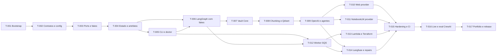

# Tasks - Agentic Knowledge Acquisition

## Status do documento

Este documento transforma o design validado em trabalho executavel e rastreavel. Ele foi revisado e aceito humanamente em 2026-07-21. A aprovacao autoriza o `/build` por incrementos, mas nao autoriza deploy, uso de credenciais reais, promocao de notas ou publicacao automatica.

Documentos de origem:

- [[DEFINE_AGENTIC_KNOWLEDGE_ACQUISITION]]
- [[DESIGN_AGENTIC_KNOWLEDGE_ACQUISITION]]

## Regras de execucao

- Executar tarefas na ordem das dependencias, nao apenas pela numeracao.
- Concluir testes offline de uma tarefa antes de iniciar sua dependente.
- Atualizar a spec por `/iterate` quando surgir lacuna de requisito ou arquitetura.
- Nao resolver lacuna relevante diretamente no codigo sem atualizar o design.
- Marcar tarefa concluida somente com codigo, testes e evidencia verificavel.
- Registrar comandos, resultados e desvios em `.Codex/sdd/reports/BUILD_REPORT_AGENTIC_KNOWLEDGE_ACQUISITION.md`.
- Nao executar testes `live` ou `eval` sem comando explicito e credenciais preparadas.
- Nao adicionar AWS, OpenAI, Langfuse, NotebookLM ou Qdrant a testes default.
- Nao misturar alteracoes do vault com o repositorio publico da aplicacao.

## Definicao de pronto global

Uma tarefa esta concluida quando:

1. todos os arquivos declarados foram criados ou atualizados;
2. os testes associados passam;
3. lint e format passam no escopo alterado;
4. nenhum secret, URL privada ou dado real foi adicionado;
5. requisitos e cenarios relacionados possuem evidencia no build report;
6. nao restam TODOs necessarios para cumprir o criterio da tarefa;
7. documentacao afetada esta sincronizada com o comportamento implementado.

## Visao dos incrementos

| Incremento | Objetivo verificavel | Tarefas | Gate |
|---|---|---|---|
| I0 | Repositorio reproduzivel e seguro | T-001 | bootstrap passa em maquina limpa |
| I1 | Nucleo deterministico local | T-002 a T-006 | graph completo com fakes e resume |
| I2 | Vault e retrieval locais | T-007 e T-008 | drafts e indice funcionam sem LLM real |
| I3 | Tres agentes com OpenAI | T-009 | contratos estruturados em teste live isolado |
| I4 | Dois providers substituiveis | T-010 e T-011 | mesma pipeline aceita web e NotebookLM |
| I5 | Trigger e worker AWS | T-012 e T-013 | request assinado chega ao worker local |
| I6 | Observabilidade e reparos | T-014 e T-015 | falhas secundarias nao repetem agentes |
| I7 | Caso real e portfolio | T-016 e T-017 | eval revisada e repositorio publicavel |

## Grafo de dependencias



## T-001 - Inicializar o bootstrap reproduzivel

**Status:** completed<br>
**Incremento:** I0  
**Dependencias:** nenhuma  
**Requisitos:** RNF-001, RNF-004, RNF-006, CA-009

### Objetivo

Inicializar no repositorio separado ja criado `agentic-knowledge-pipeline` o projeto Python 3.12 com `uv`, package `knowledge_agents`, configuracao inicial de qualidade e nenhum secret.

### Arquivos

- `LICENSE`
- `pyproject.toml`
- `uv.lock`
- `.python-version`
- `.env.example`
- `.gitignore`
- `.Codex/sdd/features/BRAINSTORM_AGENTIC_KNOWLEDGE_ACQUISITION.md`
- `.Codex/sdd/features/DEFINE_AGENTIC_KNOWLEDGE_ACQUISITION.md`
- `.Codex/sdd/features/DESIGN_AGENTIC_KNOWLEDGE_ACQUISITION.md`
- `.Codex/sdd/features/TASKS_AGENTIC_KNOWLEDGE_ACQUISITION.md`
- `.Codex/sdd/reports/BUILD_REPORT_AGENTIC_KNOWLEDGE_ACQUISITION.md`
- `src/knowledge_agents/__init__.py`
- `tests/conftest.py`

### Implementacao

- Configurar package `src` layout e entry point futuro `knowledge-agents`.
- Fixar Python `>=3.12,<3.13` no primeiro baseline.
- Adicionar dependencias por grupos `main`, `dev`, `live` e `eval` quando suportado pelo layout escolhido.
- Configurar Ruff e Pytest no `pyproject.toml`.
- Registrar markers `live` e `eval`.
- Ignorar `.env`, runtime, artifacts, SQLite, Qdrant storage, coverage e caches.
- Manter `.env.example` somente com nomes e placeholders.
- Verificar a presenca das quatro specs validadas e do registro de origem transferidos antes do build.
- Tratar as copias deste repositorio como fonte canonica durante toda a implementacao.
- Atualizar o build report sem marcar tarefas ainda nao executadas.

### Verificacao

```powershell
uv sync --locked
uv run python -c "import knowledge_agents"
uv run ruff check .
uv run pytest -m "not live and not eval"
```

### Evidencia de conclusao

- ambiente criado a partir do lockfile;
- import do package funciona;
- lint e suite vazia/base passam;
- specs e build report estao versionados no repositorio da aplicacao;
- secret scan manual do tracked tree nao encontra valores reais.

### Evidencia obtida em 2026-07-21

- branch `codex/increment-1-bootstrap-domain` criada a partir de `f5aae25`;
- os 13 arquivos declarados para T-001 estao presentes;
- `uv sync --locked` concluiu com CPython 3.12.12 e 21 pacotes resolvidos;
- `uv run python -c "import knowledge_agents"` concluiu e retornou a versao `0.1.0`;
- `uv run ruff format --check .` e `uv run ruff check .` passaram;
- `uv run pytest -m "not live and not eval"` passou com 27 testes;
- scans locais nao encontraram TODOs necessarios, credenciais em formatos conhecidos ou URLs privadas de integracao.

## T-002 - Implementar configuracao, contratos e dominio

**Status:** completed<br>
**Incremento:** I1  
**Dependencias:** T-001  
**Requisitos:** RF-001, RF-003 a RF-009, RF-011, RNF-002, RNF-003

### Objetivo

Criar o nucleo imutavel de contratos Pydantic, status, erros, hashing canonico e budgets sem dependencias de infraestrutura.

### Arquivos

- `src/knowledge_agents/config.py`
- `src/knowledge_agents/domain/contracts.py`
- `src/knowledge_agents/domain/enums.py`
- `src/knowledge_agents/domain/errors.py`
- `src/knowledge_agents/domain/hashing.py`
- `src/knowledge_agents/domain/budgets.py`
- `tests/unit/test_hashing.py`
- `tests/unit/test_budgets.py`
- `tests/contracts/test_contracts.py`
- `tests/contracts/test_prompt_outputs.py`

### Implementacao

- Usar `pydantic-settings` com prefixo final aprovado para environment variables.
- Implementar todos os contratos listados no design com `extra="forbid"` internamente.
- Manter `AcquisitionRequest` externo tolerante a campos extras e exigir apenas URL valida.
- Implementar serializacao canonica e SHA-256 para contratos e drafts.
- Implementar ledger de chamadas, tokens, custo e duracao.
- Implementar limites operacionais configuraveis e defaults do design.
- Separar error codes transitorios, contratuais, permanentes e secundarios.

### Testes

- contratos validos e invalidos;
- compatibilidade de campos opcionais;
- hash estavel sob ordem de chaves;
- budget antes e depois de uso real;
- bloqueio de chamada acima de custo, tokens, duracao ou call count;
- nenhuma chave ou path absoluto aparece em representacao segura de erro.

### Evidencia de conclusao

- schemas JSON exportados no build report;
- matriz contrato-versao registrada;
- testes de dominio passam sem rede.

### Evidencia obtida em 2026-07-21

- configuracao `pydantic-settings` usa o prefixo aprovado `KA_` e secrets tipados com `SecretStr`;
- contratos externos toleram campos extras; contratos internos sao imutaveis e usam `extra="forbid"`;
- serializacao canonica, SHA-256, taxonomia segura de erros, ledger e limites operacionais foram cobertos offline;
- 11 JSON Schemas tiveram versao e hash SHA-256 exportados no build report;
- 27 testes de contratos, outputs estruturados, hashing e budgets passaram sem rede;
- nenhuma integracao live, eval, deploy ou credencial real foi usada.

## T-003 - Definir ports, fakes e regras de dependencia

**Status:** completed<br>
**Incremento:** I1  
**Dependencias:** T-002  
**Requisitos:** RF-003, RF-009 a RF-012, RNF-004, RNF-005

### Objetivo

Estabelecer as interfaces substituiveis e os doubles usados pelos testes antes dos adapters reais.

### Arquivos

- `src/knowledge_agents/ports/providers.py`
- `src/knowledge_agents/ports/llm.py`
- `src/knowledge_agents/ports/run_store.py`
- `src/knowledge_agents/ports/artifacts.py`
- `src/knowledge_agents/ports/queue.py`
- `src/knowledge_agents/ports/vector_index.py`
- `src/knowledge_agents/ports/telemetry.py`
- `tests/fakes.py`
- `tests/unit/test_architecture_boundaries.py`

### Implementacao

- Definir `Protocol` assincromo para cada integracao.
- Fazer ports dependerem somente do dominio.
- Criar fakes deterministas, configuraveis para sucesso e falha.
- Adicionar teste de imports que bloqueie dominio importando adapters.
- Registrar chamadas nos fakes para verificacao sem mocks excessivos.

### Evidencia de conclusao

- todos os ports possuem fake funcional;
- teste arquitetural impede dependencia invertida;
- nenhum SDK externo aparece no dominio ou application layer.

### Evidencia obtida em 2026-07-21

- sete ports assincronos foram definidos para providers, LLM, run store, artifacts, queue, vector index e telemetry;
- todos os ports possuem fake deterministico configuravel para sucesso e falha, com registro explicito de chamadas;
- `tests/unit/test_architecture_boundaries.py` passou com sete casos;
- o teste arquitetural bloqueia imports de adapters, application, ports e SDKs externos no dominio;
- `tests/__init__.py` foi adicionado como suporte minimo para reutilizacao de `tests/fakes.py`.
- clarificacao registrada antes de T-006: `application/graph` pode importar LangGraph, checkpointer e seu transporte SQLite como infraestrutura de orquestracao aprovada; dominio, ports, agentes e services continuam sem SDKs externos.

## T-004 - Implementar SQLite e ArtifactStore

**Status:** completed<br>
**Incremento:** I1  
**Dependencias:** T-003  
**Requisitos:** RF-002, RF-008, RF-009, RF-011, RNF-002

### Objetivo

Fornecer estado operacional, leases, idempotencia, migrations e artefatos atomicos locais.

### Arquivos

- `src/knowledge_agents/adapters/sqlite_run_store.py`
- `src/knowledge_agents/adapters/filesystem_artifacts.py`
- `src/knowledge_agents/sql/001_initial.sql`
- `src/knowledge_agents/sql/002_indexes.sql`
- `tests/integration/test_resume.py`
- `tests/integration/test_duplicate_delivery.py`
- `tests/security/test_path_traversal.py`

### Implementacao

- Criar `runs.db` com WAL, busy timeout e migrations transacionais.
- Criar schema de runs, artifacts, attempts, index records e repair tasks.
- Implementar acquire, renew e release de lease com operacao condicional.
- Impedir dois runs ativos com mesma idempotency key.
- Escrever artifacts em temp file, fsync quando aplicavel e atomic replace.
- Validar paths relativos contra root configurado.

### Testes

- migration limpa e incremental;
- lease concorrente e expirada;
- duplicate delivery;
- resume preserva run ID;
- replay gera novo run ID;
- falha durante escrita nao deixa artifact parcial;
- traversal e symlink escape sao bloqueados.

### Evidencia de conclusao

- schema e plano de migration registrados;
- testes de crash e idempotencia passam em filesystem temporario.

### Evidencia obtida em 2026-07-21

- `runs.db` usa WAL, foreign keys, busy timeout e duas migrations transacionais idempotentes;
- schema operacional cobre runs, artifacts, attempts, index records e repair tasks;
- leases condicionais cobrem concorrencia, renovacao, expiracao e release por owner;
- idempotency key duplicada reutiliza o run original e conflito de payload falha fechado;
- resume preserva o run ID e replay exige novo run ID e nova idempotency key;
- ArtifactStore usa JSON canonico, SHA-256, fsync, temp file e atomic replace;
- traversal, path absoluto, colisao de conteudo, symlink escape simulado e falha de replace foram bloqueados;
- dez testes offline de integracao e seguranca passaram sem skips.

## T-005 - Implementar CLI e doctor offline

**Status:** completed<br>
**Incremento:** I1  
**Dependencias:** T-004  
**Requisitos:** RF-013, RF-015, RNF-003, RNF-006

### Objetivo

Expor operacao previsivel e diagnostico por profiles sem rede ou chamada paga por default.

### Arquivos

- `src/knowledge_agents/cli.py`
- `src/knowledge_agents/application/services/doctor_service.py`
- `tests/unit/test_cli.py`
- `tests/unit/test_doctor.py`

### Implementacao

- Criar Typer app com arvore de comandos definida no design.
- Implementar `doctor --profile local --json` primeiro.
- Verificar Python, config, runtime paths, SQLite e vault allowlist.
- Preparar registry extensivel de checks para profiles futuros.
- Aplicar exit codes 0, 2, 3 e 4 conforme design.
- Redigir valores sensiveis na saida humana e JSON.

### Evidencia de conclusao

- help e comandos podem ser executados apos `uv sync`;
- doctor local detecta ambiente valido e falhas criticas;
- nenhuma operacao de doctor chama OpenAI ou consome SQS.

### Evidencia obtida em 2026-07-21

- o entry point `knowledge-agents --help` exporta trigger, worker, doctor, runs, repairs e index;
- `doctor --profile local --json` verifica Python, configuracao, runtime, vault allowlist e SQLite;
- o registry aceita profiles futuros sem registrar checks de rede por default;
- saidas humana e JSON usam apenas mensagens e metadata allowlisted, sem paths ou secrets;
- exit codes 0, 2, 3 e 4 foram cobertos por testes;
- comandos futuros com side effect falham como precondicao ate suas tarefas correspondentes;
- nove testes offline de CLI e doctor passaram sem rede.

## T-006 - Implementar LangGraph principal com fakes

**Status:** completed<br>
**Incremento:** I1  
**Dependencias:** T-004, T-005  
**Requisitos:** RF-004 a RF-009, RF-011, CA-003 a CA-006, CA-008

### Objetivo

Provar o pipeline de tres subgrafos, checkpoints, transicoes e correcoes sem integracoes reais.

### Arquivos

- `src/knowledge_agents/application/graph/state.py`
- `src/knowledge_agents/application/graph/builder.py`
- `src/knowledge_agents/application/graph/nodes.py`
- `src/knowledge_agents/application/graph/routing.py`
- `src/knowledge_agents/application/agents/acquisition.py`
- `src/knowledge_agents/application/agents/curation.py`
- `src/knowledge_agents/application/agents/validation.py`
- `src/knowledge_agents/application/services/run_service.py`
- `tests/unit/test_routing.py`
- `tests/unit/test_review_policy.py`
- `tests/integration/test_graph_happy_path.py`
- `tests/integration/test_graph_revision.py`
- `tests/integration/test_resume.py`

### Implementacao

- Compilar parent graph com `AsyncSqliteSaver` em banco separado.
- Usar `thread_id=run_id`.
- Adicionar subgrafos estaticamente com persistencia por invocacao.
- Manter apenas refs, hashes, counters e warnings no state.
- Implementar loop A3 para A2 somente para drafts bloqueados.
- Congelar drafts aprovados por hash.
- Aplicar maximo de dois ciclos e progress fingerprint.
- Separar retry tecnico, contract repair e editorial revision.

### Testes

- happy path com tres chamadas principais;
- um e dois ciclos editoriais;
- problema repetido termina `enrichment_required`;
- evidencia insuficiente nao retorna ao A1;
- crash depois de cada node e resume correspondente;
- falha secundaria nao reexecuta agentes;
- state checkpoint nao contem artefatos grandes.

### Evidencia de conclusao

- grafo e rotas exportados no build report;
- todos os cenarios funcionam com fakes;
- I1 passa integralmente sem rede.

### Evidencia obtida em 2026-08-04

- parent graph compilado com `AsyncSqliteSaver`, serializer MsgPack em modo estrito e
  `thread_id=run_id`;
- tres subgrafos estaticos e per-invocation implementados, com refs, hashes, contadores,
  budgets e warnings no state;
- policy editorial cobre zero, um e dois ciclos, freeze por hash, progress fingerprint,
  `enrichment_required` e `rejected`, sem retorno editorial ao A1;
- resume validado apos cada um dos 13 nodes sem repetir agentes ou provider ja concluidos;
- falhas secundarias de index e telemetry terminam com warnings seguros e sem rerun de LLM;
- `uv run pytest -m "not live and not eval" -q`: 66 testes passaram, zero skips;
- `uv run ruff format --check .`, `uv run ruff check .`, `uv lock --check`, `uv sync
  --locked` e `uv build`: sucesso offline;
- nenhuma integracao live, eval, deploy, rede de aplicacao ou credencial real foi usada.

## T-007 - Implementar Vault Core deterministico

**Status:** completed<br>
**Incremento:** I2  
**Dependencias:** T-006  
**Requisitos:** RF-005, RF-006, RF-008, RNF-001, RNF-002

### Objetivo

Renderizar e persistir drafts e manifests somente na area permitida, sem promocao.

### Arquivos

- `src/knowledge_agents/adapters/vault_scanner.py`
- `src/knowledge_agents/adapters/vault_writer.py`
- `tests/integration/test_vault_writer.py`
- `tests/security/test_path_traversal.py`

### Implementacao

- Ler inventario Markdown com allowlist de paths.
- Renderizar frontmatter e secoes a partir de `DraftNote`.
- Persistir em `01-inbox/agent-runs/<run_id>`.
- Bloquear sobrescrita de nota canonica e colisao de note ID.
- Preservar drafts `ready`, `partially_ready` e `enrichment_required` quando uteis.
- Produzir manifest e review summary sem conteudo privado desnecessario.

### Evidencia de conclusao

- escrita atomica e idempotente;
- diff de fixture demonstra paths e conteudo esperados;
- nenhuma API de promocao, Git ou delete existe no aplicativo.

### Evidencia obtida em 2026-08-05

- `VaultScanner` le somente Markdown dentro de roots relativas allowlisted e retorna inventario
  reduzido, sem corpo das notas;
- `VaultWriter` grava exclusivamente em `01-inbox/agent-runs/<run_id>` e revalida containment e
  symlinks antes do replace atomico;
- `DraftRenderer` gera frontmatter e secoes deterministicos a partir de `DraftNote`, status e hash
  revisado;
- drafts `ready`, `partially_ready` e `enrichment_required` sao preservados; `rejected` e
  `discard` sao omitidos de forma rastreavel;
- colisao de note ID canonico, alteracao de conteudo no mesmo run, traversal, filename inseguro e
  symlink sao bloqueados;
- manifest JSON e review summary sanitizado sao persistidos sem issues, required changes ou corpos
  de drafts;
- 14 testes direcionados de integracao/seguranca e 75 testes offline totais passaram;
- Ruff, lockfile, ambiente locked e build passaram; scans de TODOs e credenciais retornaram zero
  matches;
- nenhuma API de promocao, Git ou delete foi adicionada e nenhuma integracao live foi executada.

## T-008 - Implementar chunking, embeddings e Qdrant local

**Status:** completed<br>
**Incremento:** I2  
**Dependencias:** T-007  
**Requisitos:** RF-010, RNF-002, RNF-005, CA-006

### Objetivo

Criar indice unidirecional, incremental e reconstruivel para evidencias, drafts e notas.

### Arquivos

- `docker-compose.qdrant.yml`
- `src/knowledge_agents/adapters/chunker.py`
- `src/knowledge_agents/adapters/embeddings.py`
- `src/knowledge_agents/adapters/qdrant_index.py`
- `src/knowledge_agents/application/services/index_service.py`
- `tests/unit/test_chunker.py`
- `tests/integration/test_index_sync.py`

### Implementacao

- Fixar imagem Qdrant por versao, bind somente em loopback e volume ignorado.
- Implementar chunker v1 conforme tamanho, overlap e estruturas indivisiveis.
- Criar collections e payload indexes antes da ingestao.
- Gerar point IDs deterministas.
- Implementar no-op, nova generation, validacao e remocao posterior.
- Impedir delecao quando scan estiver incompleto.
- Implementar status, sync e rebuild por CLI.

### Testes

- boundaries de heading, lista, tabela e code block;
- fingerprint muda com embedding, dimensao, chunker ou schema;
- update preserva generation anterior ate sucesso;
- Qdrant indisponivel cria repair sem perder drafts;
- alteracao no Qdrant nunca escreve no vault.

### Evidencia de conclusao

- collections podem ser apagadas e reconstruidas pelas fixtures;
- teste de sync incremental prova no-op e troca de generation.

### Evidencia obtida em 2026-08-13

- Qdrant local fixado em `qdrant/qdrant:v1.18.2`, com portas REST/gRPC publicadas somente em
  `127.0.0.1` e storage local ignorado pelo Git;
- chunker v1 cobre heading paths, paragrafos, overlap adjacente, limite rigido e preservacao de
  listas, tabelas e code blocks quando cabem;
- embeddings em lote deduplicam texto exato por SHA-256 antes do provider, sem chamada OpenAI nos
  testes;
- tres collections versionadas e sete payload indexes sao criados antes da ingestao, com cosine e
  dimensao configuravel;
- sync incremental prova no-op, IDs deterministas, nova geracao validada antes da remocao anterior,
  delecao somente apos scan completo e rebuild explicito;
- `IndexRecord` e `RepairTask` persistem no SQLite; falha simulada do Qdrant preserva a geracao
  anterior e o Markdown e registra apenas erro sanitizado;
- CLI `index status`, `index sync` e `index rebuild --yes` foi ativada com falha fechada sem
  credencial de embedding e confirmacao explicita para rebuild;
- 15 testes novos e 90 testes offline totais passaram; Ruff, lockfile, ambiente locked, build,
  Compose e scans de TODOs/credenciais passaram;
- nenhum container Qdrant foi iniciado e nenhuma integracao live, eval, deploy ou credencial real
  foi usada.

## T-009 - Implementar OpenAI adapter, prompts e tres agentes

**Status:** pending  
**Incremento:** I3  
**Dependencias:** T-008  
**Requisitos:** RF-004 a RF-007, RF-012, RNF-003, CA-001 a CA-004

### Objetivo

Substituir o LLM fake por Structured Outputs reais mantendo uma chamada por agente e pacote no happy path.

### Arquivos

- `src/knowledge_agents/adapters/openai_client.py`
- `src/knowledge_agents/prompts/agent_1/v1.md`
- `src/knowledge_agents/prompts/agent_2/v1.md`
- `src/knowledge_agents/prompts/agent_2_revision/v1.md`
- `src/knowledge_agents/prompts/agent_3/v1.md`
- `tests/contracts/test_prompt_outputs.py`
- `tests/security/test_prompt_injection.py`
- `tests/live/test_openai.py`

### Implementacao

- Usar Responses API `responses.parse` com Pydantic.
- Configurar modelo e reasoning por agente.
- Aplicar timeout e retry somente no SDK OpenAI.
- Registrar response ID, model, usage e prompt version.
- Tratar refusal, parse ausente e schema invalido.
- Permitir uma tentativa de contract repair separada.
- Delimitar fonte e vault como dados nao confiaveis.
- Aplicar `ContextBudgetManager` antes de cada chamada.

### Testes

- fixtures de cada output passam pelos schemas reais;
- prompt injection nao altera regras ou ferramentas;
- happy path produz pacote com multiplas notas em uma chamada do Agente 2;
- revisao agrupa somente bloqueados;
- live smoke test e opt-in e usa input minimo sanitizado.

### Evidencia de conclusao

- chamadas reais somente no marker `live`;
- teste default continua sem custo;
- usage ledger corresponde aos retornos do SDK.

## T-010 - Implementar WebArticleProvider seguro

**Status:** pending  
**Incremento:** I4  
**Dependencias:** T-009  
**Requisitos:** RF-003, RF-004, RF-014, RNF-001, CA-002, CA-007

### Objetivo

Adquirir posts HTTP/HTTPS publicos sem browser, cookies ou JavaScript.

### Arquivos

- `src/knowledge_agents/adapters/web_article_provider.py`
- `tests/unit/test_web_provider.py`
- `tests/security/test_ssrf.py`
- `tests/fixtures/web/crewai-public-sanitized.html`

### Implementacao

- Validar scheme, porta, hostname, DNS e todos os IPs resolvidos.
- Revalidar ate cinco redirects.
- Bloquear ranges privados, reserved, loopback, link-local e multicast.
- Limitar timeout, content type e body a 5 MiB.
- Extrair texto com Trafilatura e preservar metadata/proveniencia.
- Apagar HTML bruto apos sucesso e reter no maximo 24 horas em falha.
- Nao registrar URL completa ou body em trace.

### Evidencia de conclusao

- suite SSRF cobre IPv4, IPv6, redirect e DNS rebinding simulado;
- fixture publica sanitizada produz EvidenceBatch deterministico;
- provider alimenta o mesmo graph usado pelos fakes.

## T-011 - Implementar NotebookLMProvider via MCP read-only

**Status:** pending  
**Incremento:** I4  
**Dependencias:** T-009  
**Requisitos:** RF-003, RF-004, RF-013, RF-014, RNF-001, CA-001

### Objetivo

Integrar o proxy MCP NotebookLM existente sem expor tools mutaveis aos agentes.

### Arquivos

- `src/knowledge_agents/adapters/mcp_stdio_client.py`
- `src/knowledge_agents/adapters/notebooklm_provider.py`
- `tests/unit/test_mcp_allowlist.py`
- `tests/live/test_notebooklm.py`

### Implementacao

- Iniciar e encerrar subprocesso stdio Node de forma controlada.
- Executar handshake, `tools/list` e `server_health` no preflight.
- Comparar tools disponiveis com allowlist read-only registrada.
- Bloquear provider se tool mutavel estiver habilitada no adapter.
- Usar somente fonte unica do link compartilhado.
- Sanitizar cookies, paths, session data e URL em errors e traces.
- Adicionar checks `notebooklm` ao doctor.
- Exigir status e runtime compativeis com o registry local.

### Evidencia de conclusao

- testes default usam fake MCP;
- live smoke test read-only e manual;
- nenhum tool de escrita, delete, upload, batch ou cleanup e invocavel pelo provider.

## T-012 - Implementar QueuePort SQS e worker local

**Status:** pending  
**Incremento:** I5  
**Dependencias:** T-005, T-006  
**Requisitos:** RF-002, RF-009, RF-011, RF-015, CA-005, CA-008

### Objetivo

Consumir SQS Standard localmente com long polling, heartbeat, leases e ack terminal.

### Arquivos

- `src/knowledge_agents/adapters/sqs_queue.py`
- `src/knowledge_agents/entrypoints/worker.py`
- `tests/integration/test_duplicate_delivery.py`
- `tests/integration/test_worker_lifecycle.py`

### Implementacao

- Long polling de 20 segundos.
- Visibility timeout inicial de 180 segundos.
- Heartbeat a cada 60 segundos enquanto lease estiver valida.
- Revalidar mensagem SQS como entrada nao confiavel.
- Adquirir lease SQLite antes do graph.
- Deletar mensagem somente depois de estado terminal duravel.
- Liberar visibility ou permitir timeout em falha recuperavel.
- Encerrar worker graciosamente sem iniciar novo run.

### Evidencia de conclusao

- duplicate delivery nao repete node concluido;
- perda de heartbeat permite redelivery e resume;
- worker usa fakes em teste default e SQS real somente em live.

## T-013 - Implementar Lambda trigger e Terraform

**Status:** pending  
**Incremento:** I5  
**Dependencias:** T-012  
**Requisitos:** RF-001, RF-002, RF-012, RNF-001, RNF-006

### Objetivo

Provisionar entrada AWS autenticada que valida somente URL e publica request pequeno em SQS.

### Arquivos

- `src/knowledge_agents/entrypoints/lambda_handler.py`
- `infra/terraform/versions.tf`
- `infra/terraform/providers.tf`
- `infra/terraform/variables.tf`
- `infra/terraform/lambda.tf`
- `infra/terraform/queues.tf`
- `infra/terraform/iam.tf`
- `infra/terraform/monitoring.tf`
- `infra/terraform/outputs.tf`
- `infra/terraform/terraform.tfvars.example`
- `scripts/package_lambda.ps1`
- `tests/unit/test_lambda_handler.py`
- `tests/live/test_aws_trigger.py`

### Implementacao

- Limitar request body a 16 KiB.
- Validar `url` obrigatoria e aceitar metadata opcional.
- Gerar IDs quando ausentes e retornar `202`.
- Configurar Function URL `AWS_IAM`.
- Incluir as duas permissoes atuais de invocacao e condicao via Function URL.
- Restringir Lambda a logs e `sqs:SendMessage` na fila especifica.
- Configurar Standard queue, DLQ, redrive, retencao, logs e alarmes.
- Manter Terraform state local ignorado.

### Verificacao

```powershell
terraform fmt -check -recursive
terraform init -backend=false
terraform validate
```

### Evidencia de conclusao

- plan revisavel sem secrets;
- unit tests da Lambda passam sem AWS;
- live trigger assinado retorna run ID e mensagem chega a fila dev.

## T-014 - Implementar Langfuse, redacao e reparos secundarios

**Status:** pending  
**Incremento:** I6  
**Dependencias:** T-009, T-012  
**Requisitos:** RF-011, RF-012, RNF-001, RNF-003, CA-006

### Objetivo

Registrar uma trace sanitizada por run e reparar Qdrant/Langfuse sem repetir agentes.

### Arquivos

- `src/knowledge_agents/observability/redaction.py`
- `src/knowledge_agents/adapters/langfuse_telemetry.py`
- `src/knowledge_agents/application/services/repair_service.py`
- `tests/security/test_redaction.py`
- `tests/integration/test_secondary_repair.py`

### Implementacao

- Criar trace ID deterministico derivado do run ID.
- Modelar spans, generations e retrievers conforme design.
- Redigir antes de chamar SDK Langfuse.
- Registrar apenas metadata allowlisted.
- Enfileirar repair task local quando flush ou index falhar.
- Terminar run como `completed_with_warnings` quando sucesso principal persistiu.
- Implementar CLI de listagem e execucao de repairs.

### Evidencia de conclusao

- teste prova que URL privada, path, key e body nao saem do adapter;
- falha simulada cria repair e mantem call count dos agentes;
- live trace pode ser correlacionada pelo run ID sanitizado.

## T-015 - Consolidar hardening, CI e gates offline

**Status:** pending  
**Incremento:** I6  
**Dependencias:** T-010, T-011, T-013, T-014  
**Requisitos:** RNF-001 a RNF-006, CA-007, CA-009

### Objetivo

Transformar controles isolados em um gate reproduzivel para cada push e PR.

### Arquivos

- `.github/workflows/ci.yml`
- `tests/security/test_ssrf.py`
- `tests/security/test_path_traversal.py`
- `tests/security/test_prompt_injection.py`
- `tests/security/test_redaction.py`
- `docs/security-model.md`

### Implementacao

- Executar sync locked, Ruff, testes offline, Terraform fmt/validate e secret scan.
- Garantir ausencia de credentials no CI.
- Validar que markers live/eval nao rodam por default.
- Adicionar testes de composicao para todas as trust boundaries.
- Documentar threats, mitigacoes, riscos aceitos e resposta a incidentes de secrets.
- Verificar tracked files e fixtures antes de permitir release.

### Evidencia de conclusao

- CI verde em branch sem credentials;
- tentativa de adicionar secret de teste conhecido falha o gate;
- security suite cobre SSRF, traversal, injection, redaction e tool allowlist.

## T-016 - Executar testes live e eval CrewAI

**Status:** pending  
**Incremento:** I7  
**Dependencias:** T-015  
**Requisitos:** RF-014, CA-001, CA-002, CA-009

### Objetivo

Executar o caso real pelas duas rotas e produzir baseline comparativa sanitizada sem threshold automatico.

### Arquivos

- `tests/live/test_openai.py`
- `tests/live/test_notebooklm.py`
- `tests/live/test_aws_trigger.py`
- `tests/eval/test_crewai_comparison.py`
- `docs/evals/README.md`
- `docs/evals/crewai-cognitive-memory-baseline.md`

### Implementacao

- Registrar preflight e autorizacao explicita da run.
- Fixar commit, prompts, models, index snapshot e budgets.
- Executar NotebookLMProvider e WebArticleProvider em runs separados.
- Gerar relatorio de cobertura, suporte, proveniencia, drafts, edicao humana, tokens, custo, latencia e retries.
- Remover URL privada, conteudo integral e dados do vault.
- Submeter conclusao a revisao humana sem score automatico de passe.

### Evidencia de conclusao

- manifests privados preservados localmente;
- relatorio publico sanitizado revisado;
- gaps principais convertidos em iteracoes de DEFINE/DESIGN quando necessario.

## T-017 - Finalizar documentacao e primeira release de portfolio

**Status:** pending  
**Incremento:** I7  
**Dependencias:** T-016  
**Requisitos:** RNF-006, CA-009

### Objetivo

Tornar o repositorio compreensivel, reproduzivel e seguro para avaliacao externa.

### Arquivos

- `README.md`
- `docs/architecture.md`
- `docs/evals/README.md`
- `docs/evals/crewai-cognitive-memory-baseline.md`
- `.Codex/sdd/reports/BUILD_REPORT_AGENTIC_KNOWLEDGE_ACQUISITION.md`

### Implementacao

- Explicar problema, arquitetura atual, demo, limites e roadmap cloud.
- Incluir diagramas renderizados e verificados.
- Documentar setup offline, Qdrant local e testes opt-in.
- Mostrar rastreabilidade requisito para tarefa para teste para evidencia.
- Revisar licencas de dependencias e assets.
- Fazer auditoria final do tracked tree e historico da branch.
- Criar release somente depois de revisao humana e CI verde.

### Evidencia de conclusao

- avaliador consegue executar testes offline pelo README;
- nenhum secret, URL privada, vault real ou fonte completa esta publicado;
- build report prova atendimento dos requisitos;
- release e PR permanecem sob controle humano.

## Matriz de rastreabilidade de tarefas

| Requisito | Tarefas principais | Evidencia planejada |
|---|---|---|
| RF-001 | T-002, T-013 | request e Lambda tests |
| RF-002 | T-004, T-012, T-013 | duplicate delivery e worker lifecycle |
| RF-003 | T-003, T-010, T-011 | provider contract tests |
| RF-004 | T-002, T-006, T-009 a T-011 | AcquisitionPacket fixtures e live smoke |
| RF-005 | T-006, T-007, T-009 | DraftPackage multi-note |
| RF-006 | T-006, T-007, T-009 | review statuses e hashes |
| RF-007 | T-006, T-009 | revision graph tests |
| RF-008 | T-004, T-007 | atomic vault writes |
| RF-009 | T-004, T-006, T-012 | checkpoint resume tests |
| RF-010 | T-008, T-014 | index sync e repair |
| RF-011 | T-002, T-006, T-012, T-014 | retry ownership tests |
| RF-012 | T-013, T-014 | trace e CloudWatch evidence |
| RF-013 | T-005, T-011, T-013 | doctor profiles |
| RF-014 | T-010, T-011, T-016 | comparative eval report |
| RF-015 | T-005, T-008, T-012, T-014 | CLI tests |
| RNF-001 | T-001, T-007, T-010, T-011, T-013 a T-015 | security suite e secret scan |
| RNF-002 | T-002, T-004, T-006 a T-008 | hashes, idempotency e rebuild |
| RNF-003 | T-002, T-006, T-012, T-014 | budgets, cycles e repairs |
| RNF-004 | T-001, T-003, T-015 | offline CI |
| RNF-005 | T-003, T-008, T-010, T-011 | ports e provider parity |
| RNF-006 | T-001, T-013, T-017 | lockfile, Terraform e README |

## Sequencia recomendada de PRs

| PR | Escopo | Tarefas |
|---:|---|---|
| 1 | Bootstrap e dominio | T-001, T-002 |
| 2 | Ports, persistencia e operacao local | T-003 a T-005 |
| 3 | LangGraph com fakes | T-006 |
| 4 | Vault e Qdrant | T-007, T-008 |
| 5 | OpenAI e agentes | T-009 |
| 6 | Providers | T-010, T-011 |
| 7 | Worker e AWS trigger | T-012, T-013 |
| 8 | Observabilidade, repairs e hardening | T-014, T-015 |
| 9 | Eval e portfolio | T-016, T-017 |

Cada PR deve ser revisavel de forma independente e preservar testes default sem rede.

## Checklist de revisao humana

- [x] A granularidade das 17 tarefas esta adequada.
- [x] A ordem de dependencias esta correta.
- [x] O bootstrap esta suficientemente pequeno para o primeiro PR.
- [x] Integracoes live entram somente depois do core com fakes.
- [x] Cada requisito possui tarefa e evidencia planejada.
- [x] Os gates de seguranca sao suficientes antes da primeira run real.
- [x] A sequencia de PRs e adequada para portfolio.
- [x] O `/build` pode iniciar por T-001 e T-002.

## Historico de revisoes

| Versao | Data | Responsavel | Alteracoes |
|---|---|---|---|
| 0.1 | 2026-07-20 | Codex | Decomposicao inicial do design validado em incrementos, tarefas, dependencias e evidencias. |
| 1.0 | 2026-07-21 | Codex com validacao humana | Tarefas revisadas e aceitas; build autorizado a partir de T-001 e T-002. |
| 1.1 | 2026-07-21 | Codex | Handoff concluido e T-001 ajustada para bootstrap do repositorio ja criado, sem mudanca de escopo. |
| 1.2 | 2026-07-21 | Codex | T-001 e T-002 concluidas no primeiro incremento com evidencias offline; demais tarefas permanecem pendentes. |
| 1.3 | 2026-07-21 | Codex | T-003, T-004 e T-005 concluidas no segundo incremento com ports/fakes, persistencia local e doctor offline. |
| 1.4 | 2026-08-04 | Codex | Clarificada a boundary de T-003 para permitir LangGraph e o checkpointer SQLite somente em `application/graph`, conforme arquitetura ja validada para T-006. |
| 1.5 | 2026-08-04 | Codex | T-006 concluida no terceiro incremento com LangGraph, fakes, checkpoint SQLite, revision policy e resume offline. |
| 1.6 | 2026-08-05 | Codex | T-007 concluida no quarto incremento com Vault Core deterministico, escrita atomica, inventario allowlisted e testes offline. |
| 1.7 | 2026-08-13 | Codex | T-008 concluida na rodada seguinte com chunker v1, embeddings deduplicados, Qdrant local versionado, sync geracional, CLI e evidencias offline. |

## Proximo passo

Submeter T-008 a revisao humana. T-009 permanece pendente e nao foi executada nesta rodada:

```text
T-008 completed -> human review -> T-009 pending
```
